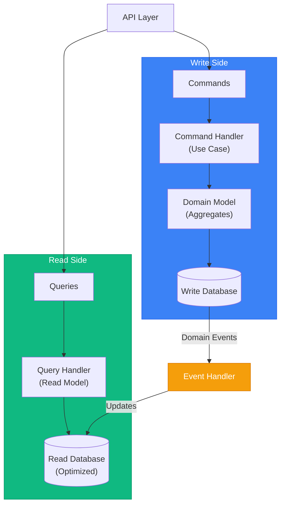

# CQRS & Domain Events

> Sources:
> - [CQRS](https://martinfowler.com/bliki/CQRS.html) — Martin Fowler
> - [Event Sourcing](https://martinfowler.com/eaaDev/EventSourcing.html) — Martin Fowler
> - [CQRS Pattern](https://learn.microsoft.com/en-us/azure/architecture/patterns/cqrs) — Microsoft Azure
> - [Transactional Outbox](https://microservices.io/patterns/data/transactional-outbox.html) — microservices.io
> - [Domain Events – Salvation](https://udidahan.com/2009/06/14/domain-events-salvation/) — Udi Dahan
> - [Strengthening Your Domain: Domain Events](https://lostechies.com/jimmybogard/2010/04/08/strengthening-your-domain-domain-events/) — Jimmy Bogard
> - [Domain Events: Design and Implementation](https://learn.microsoft.com/en-us/dotnet/architecture/microservices/microservice-ddd-cqrs-patterns/domain-events-design-implementation) — Microsoft

## CQRS Overview

**Command Query Responsibility Segregation** separates read and write operations into different models.



---

## Commands vs Queries

### Commands (Write Side)

Commands represent intent to change state. They **mutate** data. Commands use **Pydantic BaseModel** and handlers implement **IHandler**.

```python
# application/orders/create_order/command.py
from typing import Any
from pydantic import BaseModel


class CreateOrderCommand(BaseModel):
    customer_id: str
    items: list[dict[str, Any]]  # [{"product_id": str, "quantity": int}]


class ConfirmOrderCommand(BaseModel):
    order_id: str


class CancelOrderCommand(BaseModel):
    order_id: str
    reason: str


# application/orders/create_order/handler.py
from app.application.shared.handler import IHandler
from app.application.shared.uow import IOrderUoW
from app.application.orders.dto import OrderDto
from app.application.orders.assembler import OrderAssembler
from app.domain.order.entity import Order


class CreateOrderHandler(IHandler[CreateOrderCommand, OrderDto]):
    """Handler for creating orders using Unit of Work pattern."""

    def __init__(self, uow: IOrderUoW) -> None:
        self._uow = uow

    async def handle(self, command: CreateOrderCommand) -> OrderDto:
        async with self._uow as uow:
            # Create order aggregate
            order = Order.create(**command.model_dump())

            # Validate products and add items
            for item in command.items:
                product = await uow.products.find_by_id(item["product_id"])
                if not product:
                    raise ProductNotFoundError(item["product_id"])
                order.add_item(product.id, item["quantity"], product.price)

            # Save order
            await uow.orders.save(order)
            await uow.commit()

        # Return DTO
        return OrderAssembler.to_dto(order)
```

### Queries (Read Side)

Queries retrieve data without side effects. They **never mutate** state. Query handlers don't require a strict interface - they're injected via FastAPI DI.

```python
# application/orders/queries.py
from app.application.shared.pagination import PaginationParams


class GetOrderQuery(BaseModel):
    order_id: str


class GetOrdersQuery(PaginationParams):
    """Query for getting orders with optional filters."""
    customer_id: str | None = None
    status: str | None = None


# application/orders/dto.py
from pydantic import BaseModel
from datetime import datetime


class OrderItemDto(BaseModel):
    product_id: str
    product_name: str
    quantity: int
    unit_price: float
    subtotal: float


class OrderDto(BaseModel):
    id: str
    customer_id: str
    customer_name: str
    status: str
    items: list[OrderItemDto]
    total: float
    created_at: datetime
    confirmed_at: datetime | None = None


# application/orders/get_order/handler.py
from app.application.ports.driven.order_read_repository_port import IOrderReadRepository


class GetOrderHandler:
    """Handler for retrieving a single order."""

    def __init__(self, repository: IOrderReadRepository) -> None:
        self._repository = repository

    async def handle(self, query: GetOrderQuery) -> OrderDto | None:
        return await self._repository.find_by_id(query.order_id)


# application/orders/get_orders/handler.py
from app.application.shared.pagination import PaginationDto


class GetOrdersHandler:
    """Handler for retrieving multiple orders with pagination."""

    def __init__(self, repository: IOrderReadRepository) -> None:
        self._repository = repository

    async def handle(self, query: GetOrdersQuery) -> PaginationDto[OrderDto]:
        return await self._repository.get_orders(query)
```

---

## Read Model (Projection)

Optimized database structure for queries. Can denormalize data for performance. Read repositories return **DTOs directly**.

```python
# application/ports/driven/order_read_repository_port.py
from typing import Protocol
from app.application.orders.dto import OrderDto
from app.application.orders.queries import GetOrdersQuery
from app.application.shared.pagination import PaginationDto


class IOrderReadRepository(Protocol):
    """Port for order read operations."""

    async def find_by_id(self, order_id: str) -> OrderDto | None:
        """Find order by ID, returns DTO directly."""
        ...

    async def get_orders(self, query: GetOrdersQuery) -> PaginationDto[OrderDto]:
        """Get paginated orders with filters, returns DTOs."""
        ...


# infrastructure/adapters/driven/persistence/sqlalchemy/order_read_repository.py
from sqlalchemy import select
from sqlalchemy.ext.asyncio import AsyncSession
from sqlalchemy.orm import joinedload


class SqlAlchemyOrderReadRepository:
    """SQLAlchemy implementation of order read repository."""

    def __init__(self, session: AsyncSession) -> None:
        self._session = session

    async def find_by_id(self, order_id: str) -> OrderDto | None:
        stmt = (
            select(OrderModel)
            .where(OrderModel.id == order_id)
            .options(
                joinedload(OrderModel.customer),
                joinedload(OrderModel.items).joinedload(OrderItemModel.product),
            )
        )
        result = await self._session.execute(stmt)
        row = result.scalar_one_or_none()

        return self._to_dto(row) if row else None

    async def get_orders(self, query: GetOrdersQuery) -> PaginationDto[OrderDto]:
        # Build query with filters
        stmt = select(OrderModel)

        if query.customer_id:
            stmt = stmt.where(OrderModel.customer_id == query.customer_id)
        if query.status:
            stmt = stmt.where(OrderModel.status == query.status)

        # Apply pagination
        total = await self._session.scalar(select(func.count()).select_from(stmt.subquery()))
        stmt = stmt.offset(query.offset).limit(query.limit)

        result = await self._session.execute(stmt)
        rows = result.scalars().all()

        return PaginationDto(
            items=[self._to_dto(row) for row in rows],
            total=total,
            page=query.page,
            page_size=query.page_size,
        )

    def _to_dto(self, model: OrderModel) -> OrderDto:
        """Map SQLAlchemy model to DTO."""
        return OrderDto(
            id=model.id,
            customer_id=model.customer_id,
            customer_name=model.customer.name,
            status=model.status,
            items=[
                OrderItemDto(
                    product_id=item.product_id,
                    product_name=item.product.name,
                    quantity=item.quantity,
                    unit_price=item.unit_price,
                    subtotal=item.subtotal,
                )
                for item in model.items
            ],
            total=model.total,
            created_at=model.created_at,
            confirmed_at=model.confirmed_at,
        )
```

**Note:** Separate write and read databases (optional): write is normalized for transactions, read is denormalized for queries.

---

## Domain Events

Notifications that something happened in the domain. Used for:
- Updating read models
- Cross-aggregate communication
- Integration with other bounded contexts

### Event Structure

Domain events use **Pydantic BaseModel** with frozen config.

```python
# domain/shared/domain_event.py
from abc import ABC
from datetime import datetime, timezone
from uuid import uuid4
from pydantic import BaseModel, Field, ConfigDict


class DomainEvent(BaseModel, ABC):
    """Base class for domain events using Pydantic."""

    model_config = ConfigDict(frozen=True)

    event_id: str = Field(default_factory=lambda: str(uuid4()))
    occurred_at: datetime = Field(default_factory=lambda: datetime.now(timezone.utc))

    @property
    def event_type(self) -> str:
        """Return the event type identifier."""
        return self.__class__.__name__


# domain/order/events.py
from pydantic import ConfigDict


class OrderCreated(DomainEvent):
    """Event raised when an order is created."""

    model_config = ConfigDict(frozen=True)

    order_id: str
    customer_id: str


class OrderConfirmed(DomainEvent):
    """Event raised when an order is confirmed."""

    model_config = ConfigDict(frozen=True)

    order_id: str
    total_amount: float
    total_currency: str
    items: list[dict[str, str | int]]


class OrderShipped(DomainEvent):
    """Event raised when an order is shipped."""

    model_config = ConfigDict(frozen=True)

    order_id: str
    tracking_number: str
    carrier: str
```

### Event Handlers

Event handlers use async pattern and are injected via dependency injection.

```python
# application/orders/event_handlers/order_created_handler.py
from sqlalchemy.ext.asyncio import AsyncSession
from app.domain.order.events import OrderCreated
from app.infrastructure.adapters.driven.persistence.sqlalchemy.models import OrderModel


class OrderCreatedHandler:
    """Handler for OrderCreated event - updates read model."""

    def __init__(self, session: AsyncSession) -> None:
        self._session = session

    async def handle(self, event: OrderCreated) -> None:
        order_read = OrderModel(
            id=event.order_id,
            customer_id=event.customer_id,
            status="draft",
            created_at=event.occurred_at,
        )
        self._session.add(order_read)
        await self._session.commit()


# application/orders/event_handlers/order_confirmed_handler.py
from sqlalchemy import update


class OrderConfirmedHandler:
    """Handler for OrderConfirmed event - updates read model."""

    def __init__(self, session: AsyncSession) -> None:
        self._session = session

    async def handle(self, event: OrderConfirmed) -> None:
        stmt = (
            update(OrderModel)
            .where(OrderModel.id == event.order_id)
            .values(
                status="confirmed",
                total=event.total_amount,
                confirmed_at=event.occurred_at,
            )
        )
        await self._session.execute(stmt)
        await self._session.commit()


# application/orders/event_handlers/send_shipping_notification_handler.py
from app.application.ports.driven.order_repository_port import IOrderRepository
from app.application.ports.driven.notification_service_port import INotificationService


class SendShippingNotificationHandler:
    """Handler for OrderShipped event - sends notification."""

    def __init__(
        self,
        order_repo: IOrderRepository,
        notifier: INotificationService,
    ) -> None:
        self._order_repo = order_repo
        self._notifier = notifier

    async def handle(self, event: OrderShipped) -> None:
        order = await self._order_repo.find_by_id(event.order_id)
        if not order:
            return

        await self._notifier.send_email(
            to=order.customer_email,
            template="order-shipped",
            data={
                "order_id": event.order_id,
                "tracking_number": event.tracking_number,
                "carrier": event.carrier,
            },
        )
```

---

## Domain Events vs Integration Events

### Domain Events

- Stay within bounded context
- Fine-grained, low-level
- Trigger internal processes
- Named in domain language

```python
class OrderItemQuantityIncreased(DomainEvent):
    """Domain event for quantity changes within the order context."""

    model_config = ConfigDict(frozen=True)

    order_id: str
    product_id: str
    old_quantity: int
    new_quantity: int
```

### Integration Events

- Cross bounded context boundaries
- Coarser-grained
- Published to message broker
- Versioned schema

```python
# application/integration_events/order_confirmed_integration_event.py
from pydantic import BaseModel, Field


class MoneySchema(BaseModel):
    amount: float
    currency: str


class OrderItemSchema(BaseModel):
    product_id: str
    quantity: int
    unit_price: float


class ShippingAddressSchema(BaseModel):
    street: str
    city: str
    postal_code: str
    country: str


class OrderConfirmedIntegrationEvent(BaseModel):
    event_type: str = Field(default="sales.order.confirmed")
    event_id: str = Field(default_factory=lambda: str(uuid4()))
    version: str = Field(default="1.0")
    occurred_at: str
    payload: dict

    class PayloadSchema(BaseModel):
        order_id: str
        customer_id: str
        total: MoneySchema
        items: list[OrderItemSchema]
        shipping_address: ShippingAddressSchema | None
```

### Publishing Integration Events

```python
# application/orders/event_handlers/publish_order_confirmed_integration_event.py
from uuid import uuid4
from datetime import datetime, timezone
from app.application.ports.driven.message_broker_port import IMessageBroker
from app.application.ports.driven.order_repository_port import IOrderRepository
from app.domain.order.events import OrderConfirmed


class PublishOrderConfirmedIntegrationEvent:
    """Publishes integration event when order is confirmed."""

    def __init__(
        self,
        message_broker: IMessageBroker,
        order_repo: IOrderRepository,
    ) -> None:
        self._message_broker = message_broker
        self._order_repo = order_repo

    async def handle(self, domain_event: OrderConfirmed) -> None:
        order = await self._order_repo.find_by_id(domain_event.order_id)
        if not order:
            return

        integration_event = OrderConfirmedIntegrationEvent(
            event_id=str(uuid4()),
            occurred_at=datetime.now(timezone.utc).isoformat(),
            payload={
                "order_id": order.id,
                "customer_id": order.customer_id,
                "total": {
                    "amount": domain_event.total_amount,
                    "currency": domain_event.total_currency,
                },
                "items": [
                    {
                        "product_id": item["product_id"],
                        "quantity": item["quantity"],
                        "unit_price": item["unit_price"],
                    }
                    for item in domain_event.items
                ],
                "shipping_address": (
                    {
                        "street": order.shipping_address.street,
                        "city": order.shipping_address.city,
                        "postal_code": order.shipping_address.postal_code,
                        "country": order.shipping_address.country,
                    }
                    if order.shipping_address
                    else None
                ),
            },
        )

        await self._message_broker.publish(
            "order-events", integration_event.model_dump()
        )
```

---

## FastAPI Dependency Injection Pattern

Instead of command/query buses, use **FastAPI's built-in dependency injection** to inject handlers directly into route handlers.

```python
# infrastructure/adapters/driving/rest/dependencies.py
from typing import Annotated
from fastapi import Depends
from sqlalchemy.ext.asyncio import AsyncSession

from app.application.orders.create_order.handler import CreateOrderHandler
from app.application.orders.get_orders.handler import GetOrdersHandler
from app.infrastructure.adapters.driven.persistence.sqlalchemy.uow import SqlAlchemyOrderUoW
from app.infrastructure.adapters.driven.persistence.sqlalchemy.order_read_repository import (
    SqlAlchemyOrderReadRepository,
)


async def get_db_session() -> AsyncSession:
    """Provide database session."""
    async with async_session_factory() as session:
        yield session


async def get_create_order_handler(
    session: Annotated[AsyncSession, Depends(get_db_session)]
) -> CreateOrderHandler:
    """Provide CreateOrderHandler with dependencies."""
    uow = SqlAlchemyOrderUoW(session)
    return CreateOrderHandler(uow)


async def get_get_orders_handler(
    session: Annotated[AsyncSession, Depends(get_db_session)]
) -> GetOrdersHandler:
    """Provide GetOrdersHandler with dependencies."""
    repository = SqlAlchemyOrderReadRepository(session)
    return GetOrdersHandler(repository)


# infrastructure/adapters/driving/rest/routers/orders.py
from typing import Annotated
from fastapi import APIRouter, Depends, status

from app.application.orders.create_order.command import CreateOrderCommand
from app.application.orders.create_order.handler import CreateOrderHandler
from app.application.orders.get_orders.handler import GetOrdersHandler
from app.application.orders.queries import GetOrdersQuery
from app.infrastructure.adapters.driving.rest.dependencies import (
    get_create_order_handler,
    get_get_orders_handler,
)

router = APIRouter(prefix="/orders", tags=["orders"])


@router.post("/", status_code=status.HTTP_201_CREATED)
async def create_order(
    command: CreateOrderCommand,
    handler: Annotated[CreateOrderHandler, Depends(get_create_order_handler)],
):
    """Create a new order."""
    return await handler.handle(command)


@router.get("/")
async def get_orders(
    query: GetOrdersQuery = Depends(),
    handler: Annotated[GetOrdersHandler, Depends(get_get_orders_handler)],
):
    """Get orders with pagination and filters."""
    return await handler.handle(query)
```

---

## Outbox Pattern

Ensures events are published reliably (exactly-once semantics) using SQLAlchemy and async.

```python
# infrastructure/adapters/driven/persistence/sqlalchemy/outbox_repository.py
from datetime import datetime, timezone
from sqlalchemy import select, update
from sqlalchemy.ext.asyncio import AsyncSession
from pydantic import BaseModel

from app.domain.shared.domain_event import DomainEvent
from app.infrastructure.adapters.driven.persistence.sqlalchemy.models import OutboxMessageModel


class OutboxMessage(BaseModel):
    """DTO for outbox messages."""
    id: str
    event_type: str
    payload: str
    created_at: datetime
    processed_at: datetime | None = None


class SqlAlchemyOutboxRepository:
    """Repository for managing outbox pattern."""

    def __init__(self, session: AsyncSession) -> None:
        self._session = session

    async def save(self, event: DomainEvent) -> None:
        """Save domain event to outbox."""
        message = OutboxMessageModel(
            id=event.event_id,
            event_type=event.event_type,
            payload=event.model_dump_json(),
            created_at=event.occurred_at,
        )
        self._session.add(message)

    async def get_unprocessed(self, limit: int = 100) -> list[OutboxMessage]:
        """Get unprocessed messages with pessimistic locking."""
        stmt = (
            select(OutboxMessageModel)
            .where(OutboxMessageModel.processed_at.is_(None))
            .order_by(OutboxMessageModel.created_at)
            .limit(limit)
            .with_for_update(skip_locked=True)
        )
        result = await self._session.execute(stmt)
        rows = result.scalars().all()

        return [
            OutboxMessage(
                id=row.id,
                event_type=row.event_type,
                payload=row.payload,
                created_at=row.created_at,
                processed_at=row.processed_at,
            )
            for row in rows
        ]

    async def mark_processed(self, message_id: str) -> None:
        """Mark message as processed."""
        stmt = (
            update(OutboxMessageModel)
            .where(OutboxMessageModel.id == message_id)
            .values(processed_at=datetime.now(timezone.utc))
        )
        await self._session.execute(stmt)


# application/orders/create_order/handler.py
class CreateOrderHandler(IHandler[CreateOrderCommand, OrderDto]):
    """Handler with outbox pattern."""

    def __init__(
        self,
        uow: IOrderUoW,
        outbox: SqlAlchemyOutboxRepository,
    ) -> None:
        self._uow = uow
        self._outbox = outbox

    async def handle(self, command: CreateOrderCommand) -> OrderDto:
        async with self._uow as uow:
            order = Order.create(**command.model_dump())

            await uow.orders.save(order)

            # Save events to outbox
            for event in order.domain_events:
                await self._outbox.save(event)

            await uow.commit()

        return OrderAssembler.to_dto(order)


# infrastructure/messaging/outbox_processor.py
import asyncio
import logging

logger = logging.getLogger(__name__)


class OutboxProcessor:
    """Background processor for outbox messages."""

    def __init__(
        self,
        outbox: SqlAlchemyOutboxRepository,
        message_broker: IMessageBroker,
    ) -> None:
        self._outbox = outbox
        self._message_broker = message_broker

    async def process(self) -> None:
        """Process unprocessed outbox messages."""
        messages = await self._outbox.get_unprocessed()

        for message in messages:
            try:
                await self._message_broker.publish(
                    message.event_type, message.payload
                )
                await self._outbox.mark_processed(message.id)
            except Exception as e:
                logger.error(
                    f"Failed to process outbox message {message.id}: {e}"
                )
```

---

## When to Use CQRS

> **Warning:** "You should be very cautious about using CQRS... the majority of cases I've run into have not been so good." — Martin Fowler

CQRS adds significant complexity. Most applications don't need it.

### Use CQRS When:

- Read and write workloads have **dramatically** different scaling requirements
- Complex queries that genuinely don't map well to domain model
- Different teams work on read vs write sides
- Event sourcing is used (CQRS pairs naturally with ES)
- You've proven simpler approaches are insufficient

### Skip CQRS When:

- Simple CRUD application (most applications)
- Read/write patterns are similar
- Small team, simple domain
- You haven't tried a simple reporting database first
- Adding it "just in case"

**CQRS applies to specific bounded contexts, never entire systems.**

### Simplified CQRS (Start Here)

Start simple—same database, different query paths. Use **separate handlers** for commands and queries, injected via FastAPI DI:

```python
# Command Handler (writes)
class CreateOrderHandler(IHandler[CreateOrderCommand, OrderDto]):
    def __init__(self, uow: IOrderUoW) -> None:
        self._uow = uow

    async def handle(self, command: CreateOrderCommand) -> OrderDto:
        async with self._uow as uow:
            order = Order.create(**command.model_dump())
            await uow.orders.save(order)
            await uow.commit()
        return OrderAssembler.to_dto(order)


# Query Handler (reads)
class GetOrdersHandler:
    def __init__(self, repository: IOrderReadRepository) -> None:
        self._repository = repository

    async def handle(self, query: GetOrdersQuery) -> PaginationDto[OrderDto]:
        return await self._repository.get_orders(query)


# FastAPI Route (no bus needed)
@router.post("/orders")
async def create_order(
    command: CreateOrderCommand,
    handler: Annotated[CreateOrderHandler, Depends(get_create_order_handler)],
):
    return await handler.handle(command)


@router.get("/orders")
async def get_orders(
    query: GetOrdersQuery = Depends(),
    handler: Annotated[GetOrdersHandler, Depends(get_get_orders_handler)],
):
    return await handler.handle(query)
```

Evolve to separate databases only when needed.

---

## Event Sourcing: Critical Considerations

> **Warning:** "Extremely difficult to add Event Sourcing to systems not originally designed for it." — Martin Fowler

### When Event Sourcing Makes Sense

- Complete audit trail is a business requirement
- Need to reconstruct state at any point in time
- Domain is inherently event-driven (financial transactions, workflows)
- Debugging requires understanding "how did we get here?"

### When to Avoid Event Sourcing

- Simple CRUD with no audit requirements
- Team unfamiliar with event-driven patterns
- Adding it retroactively to existing system
- No clear business need for temporal queries

### Event Sourcing Requirements

1. **Events must store deltas** — Not final state, but what changed (enables reversal)
2. **Snapshots for performance** — Rebuild from snapshots, not from event 0
3. **External system handling:**
   - Disable notifications during replays
   - Cache external query results with timestamps
4. **Schema evolution strategy** — Events are forever; plan for versioning

---

## Saga Pattern (Cross-Aggregate Workflows)

For workflows spanning multiple aggregates, use sagas instead of trying to coordinate via raw domain events.

```
Saga: PlaceOrderSaga
├── Step 1: Reserve inventory (Inventory aggregate)
├── Step 2: Process payment (Payment aggregate)
├── Step 3: Confirm order (Order aggregate)
└── Compensating actions if any step fails
```

**Saga types:**
- **Choreography:** Each service listens/publishes events (simpler, harder to trace)
- **Orchestration:** Central coordinator manages steps (explicit, easier to debug)

---

## Idempotent Consumer Pattern

**Required for reliable event processing.** Messages may be delivered more than once.

```python
# application/orders/event_handlers/order_confirmed_handler.py
from sqlalchemy import select
from sqlalchemy.ext.asyncio import AsyncSession

from app.domain.order.events import OrderConfirmed
from app.infrastructure.adapters.driven.persistence.sqlalchemy.models import (
    ProcessedEventModel,
    OrderModel,
)


class IdempotentOrderConfirmedHandler:
    """Handler with idempotency check using database."""

    def __init__(self, session: AsyncSession) -> None:
        self._session = session

    async def handle(self, event: OrderConfirmed) -> None:
        # Check if already processed
        stmt = select(ProcessedEventModel).where(
            ProcessedEventModel.event_id == event.event_id
        )
        result = await self._session.execute(stmt)
        if result.scalar_one_or_none():
            return  # Already processed, skip

        # Do work
        await self._update_order(event)

        # Mark as processed
        self._session.add(
            ProcessedEventModel(
                event_id=event.event_id,
                event_type=event.event_type,
                processed_at=datetime.now(timezone.utc),
            )
        )
        await self._session.commit()

    async def _update_order(self, event: OrderConfirmed) -> None:
        """Perform the actual work."""
        stmt = (
            update(OrderModel)
            .where(OrderModel.id == event.order_id)
            .values(
                status="confirmed",
                total=event.total_amount,
                confirmed_at=event.occurred_at,
            )
        )
        await self._session.execute(stmt)
```

**Implementation options:**
- Store processed message IDs in database (recommended)
- Use message broker's deduplication features
- Design handlers to be naturally idempotent
