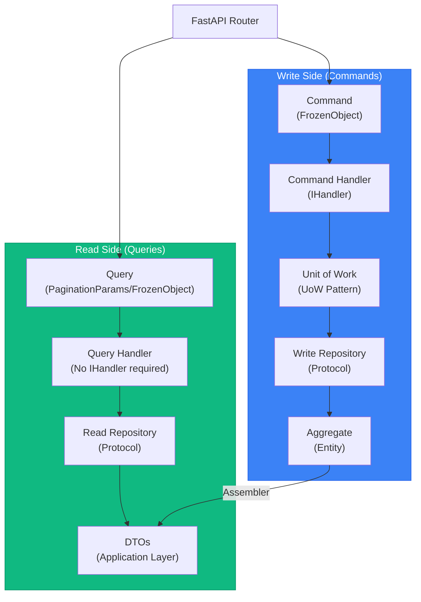

# CQRS Implementation Reference

This document consolidates the CQRS implementation guidance previously stored in the `cqrs-implementation` skill.

Pragmatic CQRS implementation using direct dependency injection with FastAPI, no command/query buses.

## When to Use This Reference

- Separating read and write concerns for clarity
- Optimizing read queries independently from writes
- Different read/write scalability requirements
- Complex queries that don't map well to domain models
- Need to denormalize data for query performance

## CRITICAL: Code Standards

**All code must follow the template standards:**

1. **Module Docstrings** - Every `.py` file MUST start with a module docstring
2. **Class Docstrings** - Every class MUST have a docstring with Attributes section
3. **Method Docstrings** - All public methods MUST have docstrings (Args, Returns, Raises)
4. **Type Hints** - ALWAYS use type hints for all parameters and return values
5. **Modern Generics** - Use `[T]` syntax, NOT `Generic[T]` (Python 3.12+)
6. **Type Unions** - Use `|` NOT `Union` or `Optional`
7. **Value Objects** - Use Pydantic BaseModel with frozen config, NOT dataclass

See the `clean-ddd-hexagonal-python` skill for complete documentation standards.

## Core Concepts

### CQRS Separation

Commands mutate state through aggregates and Unit of Work. Queries retrieve data through read repositories returning DTOs.



---

## Command Pattern (Write Side)

Commands represent intent to change state. They **mutate** data through aggregates.

### Command Structure

Commands use `FrozenObject` (Pydantic BaseModel with frozen config) for immutability.

```python
# app/application/handlers/commands/create_order_cmd.py
from app.utils import FrozenObject


class CreateOrderCommand(FrozenObject):
    """Command to create a new order."""
    customer_id: str
    items: list[dict[str, str | int]]  # [{"product_id": str, "quantity": int}]
    shipping_address: dict[str, str]


class ConfirmOrderCommand(FrozenObject):
    """Command to confirm an order."""
    order_id: str


class CancelOrderCommand(FrozenObject):
    """Command to cancel an order."""
    order_id: str
    reason: str
```

Note none of these fields carry a default. That's deliberate, not an omission — see
"Default Values on a DTO Are a Code Smell" in `../SKILL.md`. A default on `items` or
`reason` would make a business decision on the caller's behalf and hide a client that
forgot to send the field; contrast with `GetOrdersQuery` below, where `status: str |
None = None` is safe because "no filter" and "absent filter" are permanently the same
thing.

### Command Handler

Command handlers implement `IHandler[TCommand, TResult]` and use Unit of Work for transactions.

```python
# app/application/handlers/commands/create_order_cmd.py
from app.application.ports import IHandler
from app.application.ports import IOrderUoW
from app.domain.entities import Order
from app.domain.value_objects import OrderId, CustomerId, Money
from app.application.dtos import OrderDto
from app.application.mappers import OrderAssembler
from app.exceptions import ProductNotFoundError, InsufficientStockError


class CreateOrderHandler(IHandler[CreateOrderCommand, OrderDto]):
    """Handler for creating orders using Unit of Work pattern."""

    def __init__(self, uow: IOrderUoW) -> None:
        self._uow = uow

    async def handle(self, command: CreateOrderCommand) -> OrderDto:
        """
        Create order aggregate and persist using UoW.

        Returns DTO via assembler pattern.
        """
        async with self._uow as uow:
            # Create order aggregate (domain logic)
            order = Order.create(
                customer_id=CustomerId(value=command.customer_id),
                shipping_address=command.shipping_address,
            )

            # Validate products and add items (domain logic with repository queries)
            for item in command.items:
                product = await uow.products.find_by_id(item["product_id"])
                if not product:
                    raise ProductNotFoundError(item["product_id"])

                # Domain method with business rules
                order.add_item(
                    product_id=product.id,
                    quantity=item["quantity"],
                    unit_price=product.price,
                )

            # Persist aggregate
            await uow.orders.save(order)
            await uow.commit()

        # Return DTO (application layer concern)
        return OrderAssembler.to_dto(order)
```

> **CRITICAL — never return a Value Object directly from a command handler.**
> `command.customer_id` above is a raw `str`; the handler builds a `CustomerId` VO
> internally, but that VO never crosses back out. Only `OrderAssembler.to_dto(order)`
> (a DTO) leaves the handler. A command handler's job is a write-side mutation — its
> output should be minimal (an ID, an ack, or a DTO built for the caller), never a
> domain building block. Returning a VO directly reuses a write-side artifact to do a
> read-side serialization job — the stronger of the two VO/DTO violations (see the
> callout under Query Handler below for the read-side case). If the VO never leaves the
> process (consumed by another in-process module, not serialized into a response), this
> doesn't apply — there's no external contract being formed. It applies the moment the
> handler's return value gets serialized into an API response.

### Unit of Work Pattern

The UoW pattern ensures atomic transactions across multiple repositories.

#### UoW Protocol

```python
# app/application/ports/i_unit_of_work.py
import abc


class IUnitOfWork[T](abc.ABC):
    """
    Unit of Work pattern interface.

    Ensures that all repository operations within a single business transaction
    share the same database session and can be committed or rolled back atomically.
    """

    @abc.abstractmethod
    async def __aenter__(self) -> T:
        """Enter the context manager and return the unit of work instance."""
        ...

    @abc.abstractmethod
    async def __aexit__(self, exc_type, exc_val, exc_tb) -> None:
        """Exit the context manager and rollback if there was an exception."""
        ...

    @abc.abstractmethod
    async def commit(self) -> None:
        """Commit all pending changes in the current transaction."""
        ...

    @abc.abstractmethod
    async def rollback(self) -> None:
        """Rollback all pending changes in the current transaction."""
        ...
```

#### Bounded Context-Specific UoW

```python
# app/application/ports/i_order_unit_of_work.py
from __future__ import annotations
from typing import TYPE_CHECKING

if TYPE_CHECKING:
    from app.domain.repository import IOrderRepository
    from app.domain.repository import IProductRepository

from app.application.ports import IUnitOfWork


class IOrderUoW(IUnitOfWork["IOrderUoW"]):
    """Unit of Work for Order bounded context."""
    orders: IOrderRepository
    products: IProductRepository
```

#### SQLAlchemy Implementation

```python
# app/infrastructure/db/unit_of_work.py
from __future__ import annotations
import abc
from sqlalchemy.ext.asyncio import AsyncSession

from app.application.ports import IUnitOfWork
from app.application.ports import IOrderUoW
from app.infrastructure.db.repository import OrderRepository, ProductRepository


class SQLAlchemyBaseUoW[T](IUnitOfWork[T], abc.ABC):
    """
    Base implementation of Unit of Work for SQLAlchemy.

    Subclasses should initialize their repositories in __enter__ method.
    """

    def __init__(self, session: AsyncSession) -> None:
        self._session = session

    async def __aenter__(self) -> T:
        """
        Enter the context manager.
        Subclasses should initialize repositories here.
        """
        self._init_repositories()
        return self

    async def __aexit__(self, exc_type, exc_val, exc_tb) -> None:
        """
        Exit the context manager.
        Automatically rollback if an exception occurred.
        """
        if exc_type is not None:
            return await self.rollback()

        return await self._session.commit()

    async def commit(self) -> None:
        """Commit the current transaction."""
        await self._session.commit()

    async def rollback(self) -> None:
        """Rollback the current transaction."""
        await self._session.rollback()

    @abc.abstractmethod
    def _init_repositories(self) -> None:
        """Subclasses must initialize their specific repositories here."""
        ...


class SQLAlchemyOrderUoW(IOrderUoW, SQLAlchemyBaseUoW["SQLAlchemyOrderUoW"]):
    """SQLAlchemy implementation of Order UoW."""

    def __init__(self, session: AsyncSession):
        super().__init__(session)

    def _init_repositories(self) -> None:
        """Initialize repositories with shared session."""
        self.orders = OrderRepository(self._session)
        self.products = ProductRepository(self._session)
        return None
```

### FastAPI Integration (Commands)

Commands use **direct dependency injection** via factory functions and type aliases.

```python
# app/interfaces/api/v1/dependencies/order_dpd.py
from __future__ import annotations
from fastapi import Depends
from sqlalchemy.ext.asyncio import AsyncSession
from typing import Annotated

from app.application.ports import IOrderUoW
from app.application.handlers.commands import CreateOrderHandler
from app.infrastructure.db.unit_of_work import SQLAlchemyOrderUoW
from app.infrastructure.db import get_async_session


# Factory functions
async def get_order_uow(session: Annotated[AsyncSession, Depends(get_async_session)]) -> IOrderUoW:
    """Provide Order Unit of Work."""
    return SQLAlchemyOrderUoW(session)


async def create_order_handler_factory(
    uow: Annotated[IOrderUoW, Depends(get_order_uow)]
) -> CreateOrderHandler:
    """Provide CreateOrderHandler with dependencies."""
    return CreateOrderHandler(uow)


# Type aliases for clean DI
GetAsyncSessionDpd = Annotated[AsyncSession, Depends(get_async_session)]
OrderUoWDpd = Annotated[IOrderUoW, Depends(get_order_uow)]
CreateOrderHandlerDpd = Annotated[CreateOrderHandler, Depends(create_order_handler_factory)]
```

```python
# app/interfaces/api/v1/routers/orders.py
from fastapi import APIRouter, status
from typing import Annotated

from app.application.handlers.commands import CreateOrderCommand
from app.interfaces.api.v1.dependencies import CreateOrderHandlerDpd
from app.interfaces.api.v1.schemas import CreateOrderRequest, OrderResponse


router = APIRouter(prefix="/orders", tags=["orders"])


@router.post(
    "/",
    response_model=OrderResponse,
    status_code=status.HTTP_201_CREATED,
    summary="Create a new order",
)
async def create_order(
    request: CreateOrderRequest,
    handler: CreateOrderHandlerDpd,
) -> OrderResponse:
    """Create a new order."""
    cmd = CreateOrderCommand(**request.model_dump())
    dto = await handler.handle(cmd)
    # DTO → Response: model_validate is the default, not a dedicated mapper —
    # see "Four-Mapper Architecture" in ../SKILL.md for when an {Entity}ApiMapper
    # actually earns its keep.
    return OrderResponse.model_validate(dto)
```

---

## Query Pattern (Read Side)

Queries retrieve data without side effects. They **never mutate** state.

### Query Structure

Queries can extend `PaginationParams` for paginated queries or use `FrozenObject` for single-record queries.

```python
# app/application/handlers/queries/get_orders.py
from app.application.dtos import PaginationParams
from app.utils import FrozenObject


class GetOrdersQuery(PaginationParams):
    """Query for getting orders with pagination."""
    customer_id: str | None = None
    status: str | None = None


class GetOrderQuery(FrozenObject):
    """Query for getting a single order."""
    order_id: str
```

### Query Handler

Query handlers **do not** need to implement `IHandler`. They're simple classes injected via FastAPI DI.

```python
# app/application/handlers/queries/get_orders.py
from app.application.ports import IOrderReadRepository
from app.application.dtos import OrderDto, PaginationDto, PaginationParams


class GetOrdersHandler:
    """Handler for retrieving multiple orders with pagination."""

    def __init__(self, repository: IOrderReadRepository) -> None:
        self._repository = repository

    async def handle(self, query: GetOrdersQuery) -> PaginationDto[OrderDto]:
        """Get paginated orders with optional filters."""
        pagination_params = PaginationParams.model_validate(query)
        return await self._repository.get_orders(pagination_params)


class GetOrderHandler:
    """Handler for retrieving a single order."""

    def __init__(self, repository: IOrderReadRepository) -> None:
        self._repository = repository

    async def handle(self, query: GetOrderQuery) -> OrderDto | None:
        """Get order by ID."""
        return await self._repository.find_by_id(query.order_id)
```

> **Never return a Value Object directly from a query handler either.** CQRS's premise
> on the read side is that the read model is independent of the domain model — optimized
> for the client's needs, not for enforcing invariants. A VO carries domain
> invariants/behavior a read model doesn't need, so handing one back as the response
> leaks a domain building block across the API boundary. Weaker violation than the
> command-handler case (see above), but still a leak: a DTO is a contract the
> application layer controls independently of the domain model, while a VO is not a
> contract — it's internal. When the VO's shape changes (new invariant, renamed field,
> different value representation), every external consumer breaks or silently gets a
> different serialized shape, and that coupling tends to surface painfully during a
> migration rather than during code review. Map VO → DTO explicitly at the handler
> boundary, even when it feels like boilerplate for a "simple" VO — unless this handler's
> caller is strictly in-process and the result is never serialized into a response.

### Read Repository

Read repositories return **DTOs directly** (not entities). They use `Protocol` for interface definition.

```python
# app/application/ports/i_order_read_repository.py
import abc
from uuid import UUID
from app.application.dtos import OrderDto, PaginationParams, PaginationDto


class IOrderReadRepository(abc.ABC):
    """Port for order read operations."""

    @abc.abstractmethod
    async def find_by_id(self, order_id: str) -> OrderDto | None:
        """Find order by ID, returns DTO directly."""
        ...

    @abc.abstractmethod
    async def get_orders(self, filters: PaginationParams) -> PaginationDto[OrderDto]:
        """Get paginated orders with filters, returns DTOs."""
        ...

    @abc.abstractmethod
    async def show_orders_id(self) -> list[UUID]:
        """Get all order IDs (optimized query)."""
        ...
```

#### SQLAlchemy Implementation

```python
# app/infrastructure/read_model/order_read_repository.py
from uuid import UUID
from sqlalchemy import select
from sqlalchemy.ext.asyncio import AsyncSession
from sqlalchemy.orm import joinedload

from app.infrastructure.db.models import OrderModel
from app.infrastructure.db.mappers.read_mappers import OrderReadMapper
from app.infrastructure.db.utils import CursorPaginatorAsync
from app.application.dtos import PaginationParams, PaginationDto, OrderDto
from app.application.ports import IOrderReadRepository
from app.exceptions import OrderNotFoundError


class OrderReadRepository(IOrderReadRepository):
    """SQLAlchemy implementation of order read repository."""

    def __init__(self, session: AsyncSession):
        self.async_session = session
        self.paginator: CursorPaginatorAsync = CursorPaginatorAsync(
            self.async_session,
            OrderModel,
            OrderModel.pk,
        )

    async def find_by_id(self, order_id: str) -> OrderDto | None:
        """Find order with eager loading of relations."""
        stmt = (
            select(OrderModel)
            .where(OrderModel.pk == order_id)
            .options(
                joinedload(OrderModel.customer),
                joinedload(OrderModel.items),
            )
        )
        result = await self.async_session.execute(stmt)
        model = result.scalar_one_or_none()

        if not model:
            raise OrderNotFoundError(order_id)

        return OrderReadMapper.to_dto(model)

    async def get_orders(self, paged_params: PaginationParams) -> PaginationDto[OrderDto]:
        """Get paginated orders with cursor-based pagination."""
        stmt = select(OrderModel).options(
            joinedload(OrderModel.customer),
            joinedload(OrderModel.items),
        )

        result = await self.paginator.paginate(stmt, paged_params)

        # Use cast_using to transform models to DTOs
        return result.cast_using(OrderReadMapper.to_dto)

    async def show_orders_id(self) -> list[UUID]:
        """Optimized query returning only IDs."""
        stmt = select(OrderModel.pk)
        result = await self.async_session.execute(stmt)
        models = result.scalars().all()

        if not result:
            return []

        return models
```

### Read Mapper (ORM to DTO)

```python
# app/infrastructure/db/mappers/read_mappers/order_read_mapper.py
from app.infrastructure.db.models import OrderModel
from app.application.dtos import OrderDto, OrderItemDto


class OrderReadMapper:
    """Maps SQLAlchemy models directly to DTOs (read side)."""

    @staticmethod
    def to_dto(model: OrderModel) -> OrderDto:
        """Map OrderModel to OrderDto."""
        return OrderDto(
            id=str(model.pk),
            customer_id=str(model.customer_id),
            customer_name=model.customer.name,
            status=model.status,
            items=[
                OrderItemDto(
                    product_id=str(item.product_id),
                    product_name=item.product.name,
                    quantity=item.quantity,
                    unit_price=float(item.unit_price),
                    subtotal=float(item.subtotal),
                )
                for item in model.items
            ],
            total=float(model.total),
            created_at=model.created_at,
            updated_at=model.updated_at,
        )
```

### FastAPI Integration (Queries)

Queries use the same dependency injection pattern.

```python
# app/interfaces/api/v1/dependencies/order_dpd.py
from app.application.ports import IOrderReadRepository
from app.application.handlers.queries import GetOrdersHandler, GetOrderHandler
from app.infrastructure.read_model import OrderReadRepository


# Factory functions
async def order_read_repo_factory(
    session: GetAsyncSessionDpd
) -> IOrderReadRepository:
    """Provide Order Read Repository."""
    return OrderReadRepository(session)


async def get_orders_handler_factory(
    read_repo: Annotated[IOrderReadRepository, Depends(order_read_repo_factory)]
) -> GetOrdersHandler:
    """Provide GetOrdersHandler with dependencies."""
    return GetOrdersHandler(read_repo)


async def get_order_handler_factory(
    read_repo: Annotated[IOrderReadRepository, Depends(order_read_repo_factory)]
) -> GetOrderHandler:
    """Provide GetOrderHandler with dependencies."""
    return GetOrderHandler(read_repo)


# Type aliases
OrderReadRepoDpd = Annotated[IOrderReadRepository, Depends(order_read_repo_factory)]
GetOrdersHandlerDpd = Annotated[GetOrdersHandler, Depends(get_orders_handler_factory)]
GetOrderHandlerDpd = Annotated[GetOrderHandler, Depends(get_order_handler_factory)]
```

```python
# app/interfaces/api/v1/routers/orders.py
from fastapi import APIRouter, Query
from typing import Annotated

from app.application.dtos import PaginationParams
from app.application.handlers.queries import GetOrdersQuery, GetOrderQuery
from app.interfaces.api.v1.dependencies import (
    GetOrdersHandlerDpd,
    GetOrderHandlerDpd,
)
from app.interfaces.api.v1.schemas import GetOrdersResponse, OrderResponse


router = APIRouter(prefix="/orders", tags=["orders"])


@router.get("/", response_model=GetOrdersResponse)
async def get_orders(
    request: Annotated[PaginationParams, Query()],
    handler: GetOrdersHandlerDpd,
) -> GetOrdersResponse:
    """Get orders with pagination."""
    query = GetOrdersQuery(**request.model_dump())
    resp = await handler.handle(query)

    return {
        "items": [OrderResponse.model_validate(r) for r in resp.items],
        "meta": resp.meta,
    }


@router.get("/{order_id}", response_model=OrderResponse)
async def get_order(
    order_id: str,
    handler: GetOrderHandlerDpd,
) -> OrderResponse:
    """Get a single order by ID."""
    query = GetOrderQuery(order_id=order_id)
    dto = await handler.handle(query)
    return OrderResponse.model_validate(dto)
```

---

## Dependency Injection Pattern

The template uses **factory functions** and **type aliases** for clean, explicit dependency injection.

### Complete Dependencies File

```python
# app/interfaces/api/v1/dependencies/order_dpd.py
"""
FastAPI dependencies for injecting Order use cases.
"""

from __future__ import annotations
from fastapi import Depends
from sqlalchemy.ext.asyncio import AsyncSession
from typing import Annotated

# Interfaces
from app.domain.repository import IOrderRepository, IProductRepository
from app.application.ports import IOrderReadRepository
from app.application.ports import IOrderUoW

# Commands
from app.application.handlers.commands import (
    CreateOrderHandler,
    ConfirmOrderHandler,
    CancelOrderHandler,
)

# Queries
from app.application.handlers.queries import (
    GetOrderHandler,
    GetOrdersHandler,
    ListOrderIdsHandler,
)

# Infrastructure
from app.infrastructure.read_model import OrderReadRepository
from app.infrastructure.db.repository import OrderRepository, ProductRepository
from app.infrastructure.db.unit_of_work import SQLAlchemyOrderUoW
from app.infrastructure.db import get_async_session


# ============================================================================
# Factory Functions
# ============================================================================

# Repositories
def get_order_repository(session: GetAsyncSessionDpd) -> IOrderRepository:
    return OrderRepository(session)


def get_product_repository(session: GetAsyncSessionDpd) -> IProductRepository:
    return ProductRepository(session)


def order_read_repo_factory(session: GetAsyncSessionDpd) -> IOrderReadRepository:
    return OrderReadRepository(session)


# Unit of Work
def get_order_uow(session: GetAsyncSessionDpd) -> IOrderUoW:
    return SQLAlchemyOrderUoW(session)


# Command Handlers
def create_order_handler_factory(uow: OrderUoWDpd) -> CreateOrderHandler:
    return CreateOrderHandler(uow)


def confirm_order_handler_factory(uow: OrderUoWDpd) -> ConfirmOrderHandler:
    return ConfirmOrderHandler(uow)


def cancel_order_handler_factory(uow: OrderUoWDpd) -> CancelOrderHandler:
    return CancelOrderHandler(uow)


# Query Handlers
def get_orders_handler_factory(read_repo: OrderReadRepoDpd) -> GetOrdersHandler:
    return GetOrdersHandler(read_repo)


def get_order_handler_factory(read_repo: OrderReadRepoDpd) -> GetOrderHandler:
    return GetOrderHandler(read_repo)


def list_order_ids_handler_factory(read_repo: OrderReadRepoDpd) -> ListOrderIdsHandler:
    return ListOrderIdsHandler(read_repo)


# ============================================================================
# Type Aliases (Annotated Dependencies)
# ============================================================================

# fmt:off
# Session
GetAsyncSessionDpd = Annotated[AsyncSession, Depends(get_async_session)]

# Repositories
OrderRepoDpd = Annotated[IOrderRepository, Depends(get_order_repository)]
ProductRepoDpd = Annotated[IProductRepository, Depends(get_product_repository)]
OrderReadRepoDpd = Annotated[IOrderReadRepository, Depends(order_read_repo_factory)]

# Unit of Work
OrderUoWDpd = Annotated[IOrderUoW, Depends(get_order_uow)]

# Command Handlers
CreateOrderHandlerDpd = Annotated[CreateOrderHandler, Depends(create_order_handler_factory)]
ConfirmOrderHandlerDpd = Annotated[ConfirmOrderHandler, Depends(confirm_order_handler_factory)]
CancelOrderHandlerDpd = Annotated[CancelOrderHandler, Depends(cancel_order_handler_factory)]

# Query Handlers
GetOrdersHandlerDpd = Annotated[GetOrdersHandler, Depends(get_orders_handler_factory)]
GetOrderHandlerDpd = Annotated[GetOrderHandler, Depends(get_order_handler_factory)]
ListOrderIdsHandlerDpd = Annotated[ListOrderIdsHandler, Depends(list_order_ids_handler_factory)]
# fmt:on
```

---

## Directory Structure

```
app/
├── application/
│   ├── handlers/
│   │   ├── commands/
│   │   │   ├── __init__.py
│   │   │   ├── create_order_cmd.py       # Command + Handler
│   │   │   ├── confirm_order_cmd.py
│   │   │   └── cancel_order_cmd.py
│   │   └── queries/
│       ├── __init__.py
│       ├── get_orders.py             # Query + Handler
│       ├── get_order.py
│       └── list_order_ids_query.py
    ├── mappers/
    │   ├── __init__.py
    │   └── order_assembler.py            # Entity → DTO
    ├── ports/
    │   ├── __init__.py
    │   ├── i_handler.py
    │   ├── i_unit_of_work.py
    │   ├── i_order_unit_of_work.py
    │   └── i_order_read_repository.py
    └── dtos/
        ├── __init__.py
        ├── base_dto.py
        ├── pagination_dto.py
        └── order_dto.py
├── domain/
│   ├── entities/
│   │   ├── __init__.py
│   │   └── order.py                      # Order Aggregate
│   ├── value_objects/
│   │   ├── __init__.py
│   │   ├── order_id.py
│   │   └── money.py
│   └── repository/
│       ├── __init__.py
│       └── i_order_repository.py         # Write Repository Protocol
├── infrastructure/
│   ├── db/
│   │   ├── __init__.py
│   │   ├── models/
│   │   │   ├── __init__.py
│   │   │   └── order_model.py            # SQLAlchemy ORM
│   │   ├── repository/
│   │   │   ├── __init__.py
│   │   │   └── order_repository.py       # Write Repo Implementation
│   │   ├── mappers/
│   │   │   ├── __init__.py
│   │   │   ├── order_mapper.py           # ORM ↔ Entity
│   │   │   └── read_mappers/             # Split from write-side Mapper
│   │   │       ├── __init__.py
│   │   │       └── order_read_mapper.py  # ORM → DTO
│   │   └── unit_of_work.py               # UoW Implementation
│   └── read_model/
│       ├── __init__.py
│       └── order_read_repository.py      # Read Repo Implementation
└── interfaces/
    └── api/
        └── v1/
            ├── routers/
            │   ├── __init__.py
            │   └── orders.py             # FastAPI Routes
            ├── dependencies/
            │   ├── __init__.py
            │   └── order_dpd.py          # Dependency Factories
            ├── schemas/
            │   ├── __init__.py
            │   └── order_schema.py       # API Request/Response Models
            └── mappers/                  # Only when model_validate isn't enough
                ├── __init__.py
                └── order_api_mapper.py   # DTO → Response (the exception)
```
