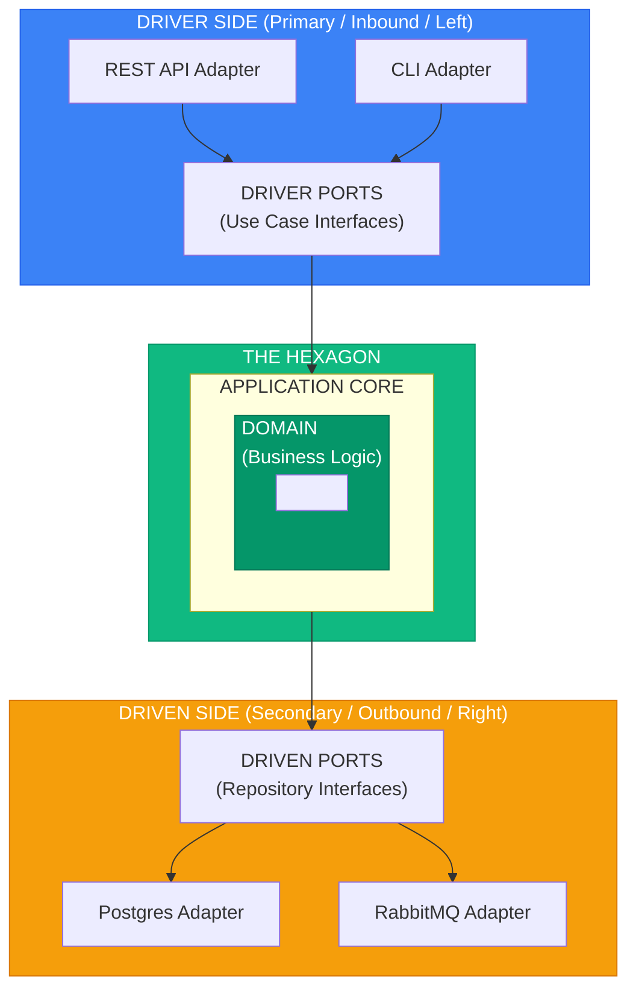

# Hexagonal Architecture (Ports & Adapters)

> Sources:
> - [Hexagonal Architecture](https://alistair.cockburn.us/hexagonal-architecture/) — Alistair Cockburn (2005)
> - [Hexagonal Architecture Explained](https://openlibrary.org/works/OL38388131W) — Alistair Cockburn & Juan Manuel Garrido de Paz (2024)
> - [Interview with Alistair Cockburn](https://jmgarridopaz.github.io/content/interviewalistair.html) — Juan Manuel Garrido de Paz
> - [Hexagonal Architecture Pattern](https://docs.aws.amazon.com/prescriptive-guidance/latest/cloud-design-patterns/hexagonal-architecture.html) — AWS

## Core Concept

> "Allow an application to equally be driven by users, programs, automated tests, or batch scripts, and to be developed and tested in isolation from its eventual run-time devices and databases."
> — Alistair Cockburn

**Design validation technique:** The pattern was designed with FIT testing in mind—business experts can write test cases before any GUI exists. If you can run your entire application from test fixtures, your hexagonal boundaries are correct.

**The hexagon is conceptual.** Most applications have 2-4 ports, not six. The shape emphasizes that all external interactions go through ports, regardless of direction.



---

## Ports

Interfaces defining how the application communicates with the outside world.

### Driver Ports (Primary / Inbound)

Define **how the world uses your application**. In this template, these are **command and query handlers** implementing the `IHandler` protocol.

```python
# app/application/ports/i_handler.py
from typing import Protocol


class IHandler[TCommand, TResult](Protocol):
    """Generic handler protocol using modern Python 3.12+ syntax."""
    async def handle(self, action: TCommand) -> TResult: ...


# app/application/handlers/commands/create_order_cmd.py
from app.application.ports import IHandler
from app.application.ports import IOrderUoW
from app.utils import FrozenObject
from app.domain.entities import Order
from app.domain.value_objects import CustomerId


class CreateOrderCommand(FrozenObject):
    customer_id: str


class CreateOrderHandler(IHandler[CreateOrderCommand, Order]):
    def __init__(self, uow: IOrderUoW) -> None:
        self._uow = uow

    async def handle(self, action: CreateOrderCommand) -> Order:
        order = Order.create(customer_id=CustomerId(value=action.customer_id))

        async with self._uow as uow:
            await uow.orders.save(order)
            await uow.commit()

        return order


# app/application/handlers/queries/get_order.py
from uuid import UUID


class GetOrderQuery(FrozenObject):
    id: UUID


class GetOrderHandler(IHandler[GetOrderQuery, OrderDTO]):
    def __init__(self, read_repo: IOrderReadRepository) -> None:
        self._read_repo = read_repo

    async def handle(self, query: GetOrderQuery) -> OrderDTO:
        return await self._read_repo.get_by_id(query.id)
```

### Driven Ports (Secondary / Outbound)

Define **how your application uses external systems**. These use `abc.ABC` for repository interfaces.

```python
# app/domain/repository/i_order_repository.py
import abc
from uuid import UUID
from app.domain.entities import Order


class IOrderRepository(abc.ABC):
    @abc.abstractmethod
    async def get_by_id(self, id: UUID) -> Order | None: ...

    @abc.abstractmethod
    async def save(self, order: Order) -> Order: ...

    @abc.abstractmethod
    async def update(self, order: Order) -> Order: ...

    @abc.abstractmethod
    async def delete(self, id: UUID) -> None: ...


# app/application/ports/i_order_read_repository.py
class IOrderReadRepository(abc.ABC):
    @abc.abstractmethod
    async def get_by_id(self, id: UUID) -> OrderDTO | None: ...

    @abc.abstractmethod
    async def find_by_status(self, status: str) -> list[OrderDTO]: ...

    @abc.abstractmethod
    async def get_all(
        self,
        page: int = 1,
        per_page: int = 10
    ) -> PaginatedResult[OrderDTO]: ...


# app/application/ports/i_order_unit_of_work.py
class IOrderUoW(abc.ABC):
    @property
    @abc.abstractmethod
    def orders(self) -> IOrderRepository: ...

    @abc.abstractmethod
    async def __aenter__(self): ...

    @abc.abstractmethod
    async def __aexit__(self, *args): ...

    @abc.abstractmethod
    async def commit(self) -> None: ...

    @abc.abstractmethod
    async def rollback(self) -> None: ...
```

---

## Adapters

Concrete implementations that connect ports to external technologies.

### Driver Adapters (Primary / Inbound)

Convert external inputs to handler calls using FastAPI with dependency injection.

```python
# app/interfaces/api/v1/routers/order.py
from fastapi import APIRouter, Query, status
from typing import Annotated
from uuid import UUID

from app.application.handlers.commands import (
    CreateOrderCommand,
    DeleteOrderCommand,
)
from app.application.handlers.queries import (
    GetOrderQuery,
    GetOrdersQuery,
)
from ..dependencies import (
    CreateOrderHandlerDpd,
    DeleteOrderHandlerDpd,
    GetOrdersHandlerDpd,
    GetOrderHandlerDpd,
)
from ..schemas.order_schema import (
    CreateOrderRequest,
    OrderResponse,
    GetOrdersResponse,
    CreateOrderResponse,
)


router = APIRouter(prefix="/orders")


@router.get("/", response_model=GetOrdersResponse)
async def get_orders(
    request: Annotated[PaginationParams, Query()],
    handler: GetOrdersHandlerDpd,
) -> GetOrdersResponse:
    query = GetOrdersQuery(**request.model_dump())
    resp = await handler.handle(query)

    return {
        "items": [OrderResponse(**r.model_dump()) for r in resp.items],
        "meta": resp.meta,
    }


@router.get("/{order_id}", response_model=OrderResponse)
async def get_order(
    order_id: UUID,
    handler: GetOrderHandlerDpd,
) -> OrderResponse:
    q = GetOrderQuery(id=order_id)
    resp = await handler.handle(q)
    return resp


@router.delete(
    "/{order_id}",
    response_model=UUID,
    summary="Delete an order",
)
async def delete_order(
    order_id: UUID,
    handler: DeleteOrderHandlerDpd,
) -> UUID:
    cmd = DeleteOrderCommand(id=order_id)
    resp = await handler.handle(cmd)
    return resp


@router.post(
    "/",
    response_model=CreateOrderResponse,
    status_code=status.HTTP_201_CREATED,
    summary="Create a new order",
)
async def create_order(
    request: CreateOrderRequest,
    handler: CreateOrderHandlerDpd,
) -> CreateOrderResponse:
    cmd = CreateOrderCommand(**request.model_dump())
    resp = await handler.handle(cmd)
    return resp


# app/interfaces/api/v1/schemas/order_schema.py
from pydantic import BaseModel
from uuid import UUID


class CreateOrderRequest(BaseModel):
    customer_id: str


class OrderResponse(BaseModel):
    id: UUID
    customer_id: UUID
    status: str
    created_at: str
    updated_at: str


class CreateOrderResponse(BaseModel):
    id: UUID
    created_at: str
```

### Driven Adapters (Secondary / Outbound)

Implement port interfaces using specific technologies like SQLAlchemy.

```python
# app/infrastructure/db/repository/order_repository.py
from sqlalchemy import select, delete
from sqlalchemy.ext.asyncio import AsyncSession
from sqlalchemy.orm import selectinload

from app.domain.repository import IOrderRepository
from app.domain.entities import Order
from app.infrastructure.db.models import OrderModel
from app.infrastructure.db.mappers import OrderMapper


class OrderRepository(IOrderRepository):
    """SQLAlchemy implementation of order repository."""

    def __init__(self, session: AsyncSession):
        self._session = session

    async def get_by_id(self, id: UUID) -> Order | None:
        stmt = (
            select(OrderModel)
            .where(OrderModel.id == id)
            .options(selectinload(OrderModel.items))
        )
        result = await self._session.execute(stmt)
        row = result.scalar_one_or_none()

        if not row:
            return None

        return OrderMapper.to_entity(row)

    async def save(self, order: Order) -> Order:
        model = OrderMapper.to_model(order)
        self._session.add(model)
        await self._session.flush()
        return order

    async def update(self, order: Order) -> Order:
        model = OrderMapper.to_model(order)
        await self._session.merge(model)
        await self._session.flush()
        return order

    async def delete(self, id: UUID) -> None:
        stmt = delete(OrderModel).where(OrderModel.id == id)
        await self._session.execute(stmt)
        await self._session.flush()


# app/infrastructure/db/models/order_model.py
from sqlalchemy import Column, String, DateTime, ForeignKey, Enum
from sqlalchemy.dialects.postgresql import UUID
from sqlalchemy.orm import relationship

from app.infrastructure.db.base import Base


class OrderModel(Base):
    __tablename__ = "orders"

    id = Column(UUID(as_uuid=True), primary_key=True)
    customer_id = Column(UUID(as_uuid=True), nullable=False)
    status = Column(String, nullable=False)
    created_at = Column(DateTime(timezone=True), nullable=False)
    updated_at = Column(DateTime(timezone=True), nullable=False)
    confirmed_at = Column(DateTime(timezone=True), nullable=True)

    items = relationship(
        "OrderItemModel",
        back_populates="order",
        cascade="all, delete-orphan"
    )


class OrderItemModel(Base):
    __tablename__ = "order_items"

    id = Column(UUID(as_uuid=True), primary_key=True)
    order_id = Column(UUID(as_uuid=True), ForeignKey("orders.id"), nullable=False)
    product_id = Column(UUID(as_uuid=True), nullable=False)
    quantity = Column(Integer, nullable=False)
    unit_price = Column(Float, nullable=False)
    currency = Column(String, nullable=False)
    created_at = Column(DateTime(timezone=True), nullable=False)

    order = relationship("OrderModel", back_populates="items")


# app/infrastructure/db/mappers/order_mapper.py
from app.domain.entities import Order, OrderItem
from app.domain.value_objects import OrderId, CustomerId, ProductId, Money, Datetime
from app.infrastructure.db.models import OrderModel, OrderItemModel


class OrderMapper:
    @staticmethod
    def to_entity(model: OrderModel) -> Order:
        """Map SQLAlchemy model to domain entity."""
        return Order(
            id=OrderId(value=model.id),
            customer_id=CustomerId(value=model.customer_id),
            status=model.status,
            items=[
                OrderItem(
                    id=OrderItemId(value=item.id),
                    product_id=ProductId(value=item.product_id),
                    quantity=item.quantity,
                    unit_price=Money(amount=item.unit_price, currency=item.currency),
                    created_at=Datetime(value=item.created_at),
                )
                for item in model.items
            ],
            created_at=Datetime(value=model.created_at),
            updated_at=Datetime(value=model.updated_at),
            confirmed_at=Datetime(value=model.confirmed_at) if model.confirmed_at else None,
        )

    @staticmethod
    def to_model(order: Order) -> OrderModel:
        """Map domain entity to SQLAlchemy model."""
        return OrderModel(
            id=order.id.value,
            customer_id=order.customer_id.value,
            status=order.status.value,
            created_at=order.created_at.value,
            updated_at=order.updated_at.value,
            confirmed_at=order.confirmed_at.value if order.confirmed_at else None,
            items=[
                OrderItemModel(
                    id=item.id.value,
                    product_id=item.product_id.value,
                    quantity=item.quantity,
                    unit_price=item.unit_price.amount,
                    currency=item.unit_price.currency,
                    created_at=item.created_at.value,
                )
                for item in order.items
            ],
        )


# app/infrastructure/read_model/order_read_repository.py
from app.application.ports import IOrderReadRepository
from app.application.dtos import OrderDTO, PaginatedResult


class OrderReadRepository(IOrderReadRepository):
    """Read-optimized repository for queries."""

    def __init__(self, session: AsyncSession):
        self._session = session

    async def get_by_id(self, id: UUID) -> OrderDTO | None:
        stmt = select(OrderModel).where(OrderModel.id == id)
        result = await self._session.execute(stmt)
        row = result.scalar_one_or_none()

        if not row:
            return None

        return OrderMapper.to_dto(row)

    async def find_by_status(self, status: str) -> list[OrderDTO]:
        stmt = select(OrderModel).where(OrderModel.status == status)
        result = await self._session.execute(stmt)
        rows = result.scalars().all()

        return [OrderMapper.to_dto(row) for row in rows]

    async def get_all(
        self,
        page: int = 1,
        per_page: int = 10
    ) -> PaginatedResult[OrderDTO]:
        offset = (page - 1) * per_page
        stmt = select(OrderModel).limit(per_page).offset(offset)
        result = await self._session.execute(stmt)
        rows = result.scalars().all()

        items = [OrderMapper.to_dto(row) for row in rows]

        return PaginatedResult(
            items=items,
            meta={"page": page, "per_page": per_page, "total": len(items)}
        )
```

---

## Dependency Injection Pattern

This template uses **factory functions** with FastAPI's `Depends` instead of a DI container.

### Dependency Factory Functions

```python
# app/interfaces/api/v1/dependencies/order_dpd.py
from fastapi import Depends
from sqlalchemy.ext.asyncio import AsyncSession
from typing import Annotated

from app.domain.repository import IOrderRepository
from app.application.ports import IOrderReadRepository, IOrderUoW
from app.application.handlers.commands import CreateOrderHandler, DeleteOrderHandler
from app.application.handlers.queries import GetOrderHandler, GetOrdersHandler

from app.infrastructure.read_model import OrderReadRepository
from app.infrastructure.db.repository import OrderRepository
from app.infrastructure.db.unit_of_work import SQLAlchemyOrderUoW
from app.infrastructure.db import get_async_session


# Session dependency
def get_async_session() -> AsyncSession:
    # Implementation in app/infrastructure/db/session.py
    ...


# Repository factories
def get_order_repository(session: GetAsyncSessionDpd) -> IOrderRepository:
    return OrderRepository(session)


def order_read_repo_instance(session: GetAsyncSessionDpd) -> IOrderReadRepository:
    return OrderReadRepository(session)


def get_order_uow(session: GetAsyncSessionDpd) -> IOrderUoW:
    return SQLAlchemyOrderUoW(session)


# Handler factories
def create_order_instance(uow: OrderUoWDpd) -> CreateOrderHandler:
    return CreateOrderHandler(uow)


def delete_order_instance(uow: OrderUoWDpd) -> DeleteOrderHandler:
    return DeleteOrderHandler(uow)


def get_orders_handler_instance(read_repo: OrderReadDpd) -> GetOrdersHandler:
    return GetOrdersHandler(read_repo)


def get_order_handler_instance(read_repo: OrderReadDpd) -> GetOrderHandler:
    return GetOrderHandler(read_repo)


# Type aliases for dependencies
GetAsyncSessionDpd = Annotated[AsyncSession, Depends(get_async_session)]

# Repositories
OrderRepoDpd = Annotated[IOrderRepository, Depends(get_order_repository)]
OrderReadDpd = Annotated[IOrderReadRepository, Depends(order_read_repo_instance)]

# Unit of Work
OrderUoWDpd = Annotated[IOrderUoW, Depends(get_order_uow)]

# Handlers
CreateOrderHandlerDpd = Annotated[CreateOrderHandler, Depends(create_order_instance)]
DeleteOrderHandlerDpd = Annotated[DeleteOrderHandler, Depends(delete_order_instance)]
GetOrdersHandlerDpd = Annotated[GetOrdersHandler, Depends(get_orders_handler_instance)]
GetOrderHandlerDpd = Annotated[GetOrderHandler, Depends(get_order_handler_instance)]
```

### Usage in Routers

```python
# app/interfaces/api/v1/routers/order.py
@router.post("/", response_model=CreateOrderResponse)
async def create_order(
    request: CreateOrderRequest,
    handler: CreateOrderHandlerDpd,  # Dependency injected
) -> CreateOrderResponse:
    cmd = CreateOrderCommand(**request.model_dump())
    return await handler.handle(cmd)
```

---

## Naming Conventions

### Template Pattern

| Component | Pattern | Example |
|-----------|---------|---------|
| Repository Interface | `I{Aggregate}Repository` | `IOrderRepository` |
| Read Repository | `I{Aggregate}ReadRepository` | `IOrderReadRepository` |
| Repository Impl | `{Aggregate}Repository` | `OrderRepository` |
| Read Repo Impl | `{Aggregate}ReadRepository` | `OrderReadRepository` |
| UoW Interface | `I{Aggregate}UoW` | `IOrderUoW` |
| UoW Implementation | `SQLAlchemy{Aggregate}UoW` | `SQLAlchemyOrderUoW` |
| Command | `{Action}{Aggregate}Command` | `CreateOrderCommand` |
| Handler | `{Action}{Aggregate}Handler` | `CreateOrderHandler` |
| Query | `{Action}{Aggregate}Query` | `GetOrderQuery` |
| DTO | `{Aggregate}DTO` | `OrderDTO` |
| Dependency Type Alias | `{Name}Dpd` | `OrderUoWDpd` |

### Project Structure

```
app/
├── domain/                         # Pure domain layer
│   ├── entities/
│   │   ├── base.py
│   │   └── order.py
│   ├── value_objects/
│   │   ├── base.py
│   │   ├── order_id.py
│   │   └── money.py
│   ├── repository/                 # Repository interfaces
│   │   ├── __init__.py
│   │   └── i_order_repository.py
│   └── services/                   # Domain services
│       └── pricing_service.py
├── application/                    # Use cases
│   ├── ports/                      # Application interfaces
│   │   ├── i_handler.py
│   │   ├── i_unit_of_work.py
│   │   ├── i_order_unit_of_work.py
│   │   └── i_order_read_repository.py
│   ├── handlers/
│   │   ├── commands/
│   │   │   └── create_order_cmd.py
│   │   └── queries/
│   │       └── get_order.py
│   ├── dtos/                       # Data Transfer Objects
│   │   ├── base_dto.py
│   │   └── order_dto.py
│   └── mappers/                    # Assemblers (Entity <-> DTO)
│       └── order_assembler.py
├── infrastructure/                 # External adapters
│   ├── db/
│   │   ├── models/
│   │   │   └── order_model.py
│   │   ├── repository/
│   │   │   └── order_repository.py
│   │   ├── mappers/                # Entity <-> ORM mappers
│   │   │   └── order_mapper.py
│   │   ├── unit_of_work.py
│   │   └── session.py
│   └── read_model/                 # Read-optimized repositories
│       └── order_read_repository.py
└── interfaces/                     # API layer
    └── api/
        └── v1/
            ├── routers/
            │   └── order.py
            ├── dependencies/       # DI factories
            │   └── order_dpd.py
            └── schemas/            # API request/response schemas
                └── order_schema.py
```

---

## Benefits

1. **Testability** - Swap real adapters for test doubles
2. **Flexibility** - Change technologies without changing core
3. **Independence** - Develop core without external systems
4. **Clear boundaries** - Explicit interfaces between layers
5. **Parallel development** - Teams work on different adapters
6. **Type safety** - FastAPI dependencies provide strong typing
