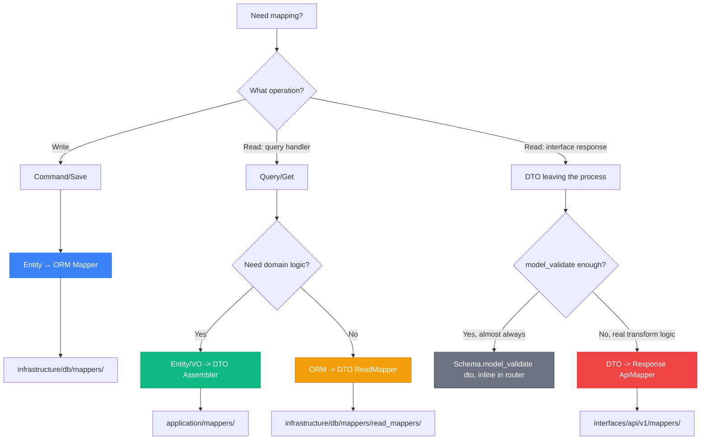
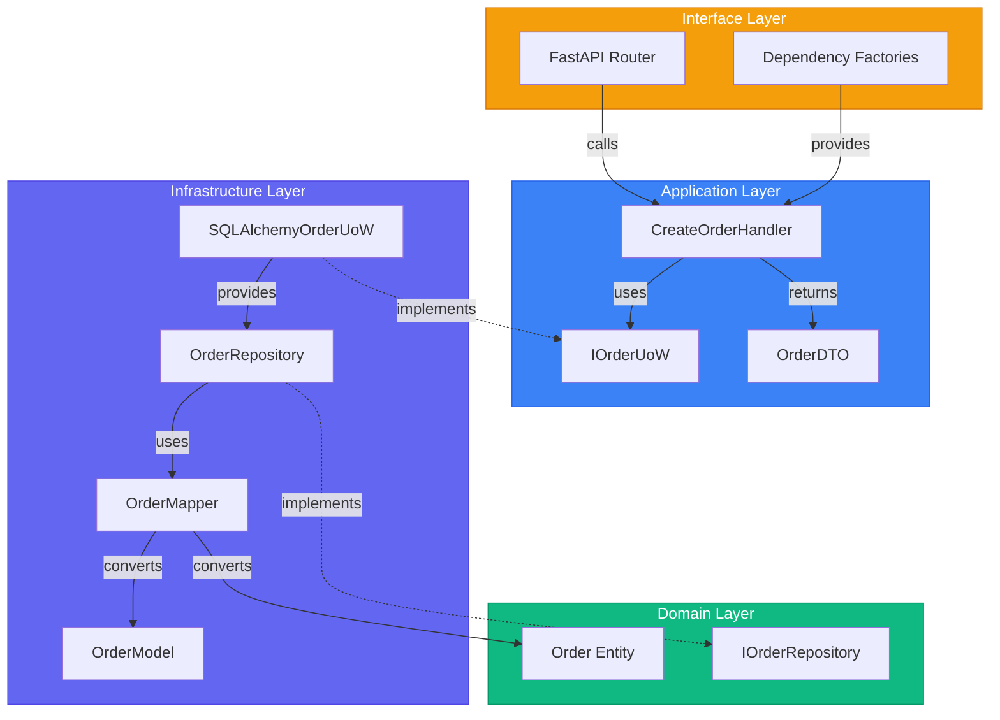

# Layer Structure - Complete Reference

> Sources:
> - [The Clean Architecture](https://blog.cleancoder.com/uncle-bob/2012/08/13/the-clean-architecture.html) — Robert C. Martin
> - [Designing a DDD-oriented Microservice](https://learn.microsoft.com/en-us/dotnet/architecture/microservices/microservice-ddd-cqrs-patterns/ddd-oriented-microservice) — Microsoft
> - [Clean Architecture: Standing on the Shoulders of Giants](https://herbertograca.com/2017/09/28/clean-architecture-standing-on-the-shoulders-of-giants/) — Herberto Graça

## The Four Layers

| Layer | Responsibility | Dependencies |
|-------|---------------|--------------|
| **Domain** | Business logic, entities, rules | None (pure) |
| **Application** | Use cases, orchestration | Domain |
| **Infrastructure** | External systems, frameworks | Application, Domain |
| **Interface** | API/UI entry points | Application |

---

## Project Structure

```
app/
├── domain/                         # Pure domain layer
│   ├── entities/
│   │   ├── base.py                # @dataclass(slots=True, kw_only=True)
│   │   └── order.py
│   ├── value_objects/
│   │   ├── base.py                # Pydantic ValueObject (frozen=True)
│   │   ├── order_id.py
│   │   ├── money.py
│   │   ├── email.py
│   │   └── datetime.py
│   ├── repository/                 # Repository interfaces (abc.ABC)
│   │   └── i_order_repository.py
│   └── services/                   # Domain services
│       └── pricing_service.py
├── application/                    # Use cases
│   ├── ports/                      # Application interfaces
│   │   ├── i_handler.py           # Generic handler protocol
│   │   ├── i_unit_of_work.py
│   │   ├── i_order_unit_of_work.py
│   │   └── i_order_read_repository.py
│   ├── handlers/
│   │   ├── commands/
│   │   │   └── create_order_cmd.py
│   │   └── queries/
│   │       └── get_order.py
│   ├── dtos/                       # Data Transfer Objects (Pydantic)
│   │   ├── base_dto.py
│   │   ├── order_dto.py
│   │   └── pagination_dto.py
│   └── mappers/                    # Assemblers (Entity <-> DTO)
│       └── order_assembler.py
├── infrastructure/                 # External adapters
│   ├── db/
│   │   ├── models/
│   │   │   └── order_model.py     # SQLAlchemy models
│   │   ├── repository/
│   │   │   └── order_repository.py
│   │   ├── mappers/                # Entity <-> ORM mappers
│   │   │   └── order_mapper.py
│   │   ├── unit_of_work.py
│   │   └── session.py
│   └── read_model/                 # Read-optimized repositories
│       └── order_read_repository.py # ORM <-> DTO mappers
└── interfaces/                     # API layer
    ├── api/
    │   └── v1/
    │       ├── routers/
    │       │   └── order.py
    │       ├── dependencies/       # DI factory functions
    │       │   └── order_dpd.py
    │       └── schemas/            # API request/response schemas
    │           └── order_schema.py
    └── gRPC/
        └── order_servicer.py
```

---

## Domain Layer (Innermost)

The **heart of the system**. Contains business logic and rules with **zero external dependencies**.

### Contents

- **Entities**: Use `@dataclass(slots=True, kw_only=True)` with `create()` classmethod
- **Value Objects**: Use Pydantic-based `ValueObject` (frozen=True)
- **Repository Interfaces**: Use `abc.ABC`
- **Domain Services**: Stateless business logic

### Rules

1. **No framework imports** - No SQLAlchemy, FastAPI, etc.
2. **No infrastructure concerns** - No database, no HTTP
3. **Pure business logic** - Only language primitives and domain types
4. **Rich behavior** - Methods that enforce business rules

### Example: Domain Entity

```python
# app/domain/entities/base.py
import abc
from dataclasses import dataclass
from typing import Any


@dataclass(slots=True, kw_only=True)
class Entity[T]:
    @classmethod
    @abc.abstractmethod
    def create(cls, **kwargs: Any) -> T: ...


# app/domain/entities/order.py
from __future__ import annotations
from dataclasses import dataclass, field
from enum import Enum

from app.domain.entities import Entity
from app.domain.value_objects import OrderId, CustomerId, Datetime


class OrderStatus(str, Enum):
    DRAFT = "draft"
    CONFIRMED = "confirmed"
    SHIPPED = "shipped"
    CANCELLED = "cancelled"


@dataclass
class Order(Entity["Order"]):
    id: OrderId
    customer_id: CustomerId
    status: OrderStatus
    items: list[OrderItem] = field(default_factory=list)
    created_at: Datetime = field(default_factory=Datetime.now)
    updated_at: Datetime = field(default_factory=Datetime.now)

    @classmethod
    def create(cls, customer_id: CustomerId) -> "Order":
        """Create a new draft order."""
        return Order(
            id=OrderId(),
            customer_id=customer_id,
            status=OrderStatus.DRAFT,
            created_at=Datetime.now(),
            updated_at=Datetime.now(),
        )

    def confirm(self) -> None:
        """Confirm the order."""
        if self.status != OrderStatus.DRAFT:
            raise ValueError(f"Cannot confirm {self.status.value} order")
        if not self.items:
            raise ValueError("Cannot confirm order with no items")

        self.status = OrderStatus.CONFIRMED
        self.updated_at = Datetime.now()

    def __eq__(self, other: object) -> bool:
        if not isinstance(other, Order):
            return False
        return self.id == other.id

    def __hash__(self) -> int:
        return hash(self.id)
```

### Example: Value Objects

```python
# app/domain/value_objects/base.py
from pydantic import BaseModel, ConfigDict


class ValueObject(BaseModel):
    model_config = ConfigDict(frozen=True, from_attributes=True)

    def __str__(self):
        if hasattr(self, "value"):
            return str(self.value)
        return super().__str__()


# app/domain/value_objects/money.py
class Money(ValueObject):
    amount: float
    currency: str

    def add(self, other: "Money") -> "Money":
        if self.currency != other.currency:
            raise ValueError(f"Cannot add {self.currency} and {other.currency}")
        return Money(amount=self.amount + other.amount, currency=self.currency)

    @staticmethod
    def zero(currency: str = "USD") -> "Money":
        return Money(amount=0.0, currency=currency)
```

### Example: Repository Interface

```python
# app/domain/repository/i_order_repository.py
import abc
from uuid import UUID
from app.domain.entities import Order


class IOrderRepository(abc.ABC):
    @abc.abstractmethod
    async def get_by_id(self, id: UUID) -> Order | None: ...

    @abc.abstractmethod
    async def save(self, order: Order) -> Order: ...

    @abc.abstractmethod
    async def update(self, order: Order) -> Order: ...

    @abc.abstractmethod
    async def delete(self, id: UUID) -> None: ...
```

---

## Application Layer

Orchestrates use cases by coordinating domain objects. Contains **application-specific business rules**.

### Contents

- **Ports**: Interfaces defining application boundaries
- **Handlers**: Command and query handlers (CQRS)
- **DTOs**: Immutable data transfer objects (Pydantic)
- **Mappers/Assemblers**: Entity ↔ DTO conversion
- **UoW Interfaces**: Transaction boundaries

### Rules

1. **Depends only on Domain** - No infrastructure imports
2. **Defines ports** - Interfaces for repositories, external services
3. **Orchestrates, doesn't implement** - Calls domain methods
4. **Transaction boundary** - Manages unit of work

### Example: Command Handler

```python
# app/application/ports/i_handler.py
"""Generic handler protocol for commands and queries."""

from typing import Protocol


class IHandler[TCommand, TResult](Protocol):
    """Generic handler protocol using modern Python 3.12+ syntax.

    Type parameters:
        TCommand: The command/query input type
        TResult: The result/output type
    """
    async def handle(self, action: TCommand) -> TResult:
        """Execute the command/query.

        Args:
            action: The command or query to execute

        Returns:
            The result of the execution
        """
        ...


# app/application/handlers/commands/create_order_cmd.py
from app.application.ports import IHandler, IOrderUoW
from app.utils import FrozenObject
from app.domain.entities import Order
from app.domain.value_objects import CustomerId


class CreateOrderCommand(FrozenObject):
    customer_id: str


class CreateOrderHandler(IHandler[CreateOrderCommand, Order]):
    def __init__(self, uow: IOrderUoW) -> None:
        self._uow = uow

    async def handle(self, action: CreateOrderCommand) -> Order:
        order = Order.create(customer_id=CustomerId(value=action.customer_id))

        async with self._uow as uow:
            await uow.orders.save(order)
            await uow.commit()

        return order
```

### Example: Query Handler

```python
# app/application/handlers/queries/get_order.py
from uuid import UUID


class GetOrderQuery(FrozenObject):
    id: UUID


class GetOrderHandler(IHandler[GetOrderQuery, OrderDTO]):
    def __init__(self, read_repo: IOrderReadRepository) -> None:
        self._read_repo = read_repo

    async def handle(self, query: GetOrderQuery) -> OrderDTO:
        return await self._read_repo.get_by_id(query.id)
```

### Example: DTOs

```python
# app/application/dtos/base_dto.py
from app.utils import FrozenObject


class BaseDto(FrozenObject): ...


# app/application/dtos/order_dto.py
from uuid import UUID


class OrderDTO(BaseDto):
    id: UUID
    customer_id: UUID
    status: str
    created_at: str
    updated_at: str
```

### Example: Assembler (Entity ↔ DTO)

```python
# app/application/mappers/order_assembler.py
from app.domain.entities import Order
from app.application.dtos import OrderDTO


class OrderAssembler:
    """Entity/VO -> DTO only. An Assembler never runs in reverse — a DTO is a
    read-side contract, not a source of domain state to rebuild an Entity from."""

    @staticmethod
    def to_dto(order: Order) -> OrderDTO:
        """Convert domain entity to DTO."""
        return OrderDTO(
            id=order.id.value,
            customer_id=order.customer_id.value,
            status=order.status.value,
            created_at=str(order.created_at),
            updated_at=str(order.updated_at),
        )
```

### Example: Unit of Work Interface

```python
# app/application/ports/i_order_unit_of_work.py
import abc


class IOrderUoW(abc.ABC):
    @property
    @abc.abstractmethod
    def orders(self) -> IOrderRepository: ...

    @abc.abstractmethod
    async def __aenter__(self): ...

    @abc.abstractmethod
    async def __aexit__(self, *args): ...

    @abc.abstractmethod
    async def commit(self) -> None: ...

    @abc.abstractmethod
    async def rollback(self) -> None: ...
```

---

## Infrastructure Layer

Implements interfaces defined in Domain and Application layers. Contains **all external concerns**.

### Contents

- **DB Models**: SQLAlchemy ORM models
- **Repositories**: Concrete implementations
- **Mappers**: Entity ↔ ORM, ORM ↔ DTO
- **Unit of Work**: SQLAlchemy UoW implementation
- **Read Models**: Query-optimized repositories
- **External Services**: Payment gateways, email, etc.

### Rules

1. **Implements ports** - Concrete classes for interfaces
2. **Contains framework code** - SQLAlchemy, HTTP clients, etc.
3. **Maps between layers** - Domain ↔ Database mapping
4. **Easily replaceable** - Can swap Postgres for MongoDB

### Example: SQLAlchemy Models

```python
# app/infrastructure/db/models/order_model.py
from sqlalchemy import Column, String, DateTime, ForeignKey, Integer
from sqlalchemy.dialects.postgresql import UUID
from sqlalchemy.orm import relationship

from app.infrastructure.db.base import Base


class OrderModel(Base):
    __tablename__ = "orders"

    id = Column(UUID(as_uuid=True), primary_key=True)
    customer_id = Column(UUID(as_uuid=True), nullable=False)
    status = Column(String, nullable=False)
    created_at = Column(DateTime(timezone=True), nullable=False)
    updated_at = Column(DateTime(timezone=True), nullable=False)

    items = relationship(
        "OrderItemModel",
        back_populates="order",
        cascade="all, delete-orphan"
    )


class OrderItemModel(Base):
    __tablename__ = "order_items"

    id = Column(UUID(as_uuid=True), primary_key=True)
    order_id = Column(UUID(as_uuid=True), ForeignKey("orders.id"), nullable=False)
    product_id = Column(UUID(as_uuid=True), nullable=False)
    quantity = Column(Integer, nullable=False)
    unit_price = Column(Float, nullable=False)
    currency = Column(String, nullable=False)

    order = relationship("OrderModel", back_populates="items")
```

### Example: Repository Implementation

```python
# app/infrastructure/db/repository/order_repository.py
from sqlalchemy import select, delete
from sqlalchemy.ext.asyncio import AsyncSession
from sqlalchemy.orm import selectinload

from app.domain.repository import IOrderRepository
from app.domain.entities import Order
from app.infrastructure.db.models import OrderModel
from app.infrastructure.db.mappers import OrderMapper


class OrderRepository(IOrderRepository):
    def __init__(self, session: AsyncSession):
        self._session = session

    async def get_by_id(self, id: UUID) -> Order | None:
        stmt = (
            select(OrderModel)
            .where(OrderModel.id == id)
            .options(selectinload(OrderModel.items))
        )
        result = await self._session.execute(stmt)
        row = result.scalar_one_or_none()

        if not row:
            return None

        return OrderMapper.to_entity(row)

    async def save(self, order: Order) -> Order:
        model = OrderMapper.to_orm(order)
        self._session.add(model)
        await self._session.flush()
        return order

    async def update(self, order: Order) -> Order:
        model = OrderMapper.to_orm(order)
        await self._session.merge(model)
        await self._session.flush()
        return order

    async def delete(self, id: UUID) -> None:
        stmt = delete(OrderModel).where(OrderModel.id == id)
        await self._session.execute(stmt)
        await self._session.flush()
```

### Example: Entity ↔ ORM Mapper

```python
# app/infrastructure/db/mappers/order_mapper.py
from app.domain.entities import Order, OrderItem
from app.domain.value_objects import OrderId, CustomerId, Datetime
from app.infrastructure.db.models import OrderModel, OrderItemModel


class OrderMapper:
    @staticmethod
    def to_entity(model: OrderModel) -> Order:
        """Map SQLAlchemy model to domain entity."""
        return Order(
            id=OrderId(value=model.id),
            customer_id=CustomerId(value=model.customer_id),
            status=model.status,
            items=[
                OrderItem(
                    id=OrderItemId(value=item.id),
                    product_id=ProductId(value=item.product_id),
                    quantity=item.quantity,
                    unit_price=Money(amount=item.unit_price, currency=item.currency),
                )
                for item in model.items
            ],
            created_at=Datetime(value=model.created_at),
            updated_at=Datetime(value=model.updated_at),
        )

    @staticmethod
    def to_orm(order: Order) -> OrderModel:
        """Map domain entity to SQLAlchemy model."""
        return OrderModel(
            id=order.id.value,
            customer_id=order.customer_id.value,
            status=order.status.value,
            created_at=order.created_at.value,
            updated_at=order.updated_at.value,
            items=[
                OrderItemModel(
                    id=item.id.value,
                    product_id=item.product_id.value,
                    quantity=item.quantity,
                    unit_price=item.unit_price.amount,
                    currency=item.unit_price.currency,
                )
                for item in order.items
            ],
        )
```

### Example: Read Model (ORM ↔ DTO)

```python
# app/infrastructure/read_model/order_read_repository.py
from app.application.ports import IOrderReadRepository
from app.application.dtos import OrderDTO


class OrderReadRepository(IOrderReadRepository):
    """Read-optimized repository for queries."""

    def __init__(self, session: AsyncSession):
        self._session = session

    async def get_by_id(self, id: UUID) -> OrderDTO | None:
        stmt = select(OrderModel).where(OrderModel.id == id)
        result = await self._session.execute(stmt)
        row = result.scalar_one_or_none()

        if not row:
            return None

        # Direct ORM -> DTO mapping (no entity conversion)
        return OrderDTO(
            id=row.id,
            customer_id=row.customer_id,
            status=row.status,
            created_at=row.created_at.isoformat(),
            updated_at=row.updated_at.isoformat(),
        )
```

### Example: Unit of Work Implementation

```python
# app/infrastructure/db/unit_of_work.py
from sqlalchemy.ext.asyncio import AsyncSession

from app.application.ports import IOrderUoW
from app.infrastructure.db.repository import OrderRepository


class SQLAlchemyOrderUoW(IOrderUoW):
    def __init__(self, session: AsyncSession):
        self._session = session

    @property
    def orders(self) -> IOrderRepository:
        return OrderRepository(self._session)

    async def __aenter__(self):
        return self

    async def __aexit__(self, exc_type, exc_val, exc_tb):
        if exc_type:
            await self.rollback()
        await self._session.close()

    async def commit(self) -> None:
        await self._session.commit()

    async def rollback(self) -> None:
        await self._session.rollback()
```

---

## Interface Layer

Entry points to the application. Adapts external requests to application commands/queries.

### Contents

- **Routers**: FastAPI route definitions
- **Dependencies**: DI factory functions
- **Schemas**: API request/response schemas (Pydantic)
- **gRPC Servicers**: gRPC implementations

### Rules

1. **Depends on Application** - Calls handlers
2. **Framework-specific** - FastAPI, gRPC, etc.
3. **Thin layer** - No business logic
4. **Maps requests to commands/queries**

### Example: FastAPI Router

```python
# app/interfaces/api/v1/routers/order.py
from fastapi import APIRouter, Query, status
from typing import Annotated
from uuid import UUID

from app.application.handlers.commands import CreateOrderCommand
from app.application.handlers.queries import GetOrderQuery
from ..dependencies import CreateOrderHandlerDpd, GetOrderHandlerDpd
from ..schemas.order_schema import CreateOrderRequest, OrderResponse


router = APIRouter(prefix="/orders")


@router.get("/{order_id}", response_model=OrderResponse)
async def get_order(
    order_id: UUID,
    handler: GetOrderHandlerDpd,
) -> OrderResponse:
    q = GetOrderQuery(id=order_id)
    resp = await handler.handle(q)
    return resp


@router.post(
    "/",
    response_model=OrderResponse,
    status_code=status.HTTP_201_CREATED,
)
async def create_order(
    request: CreateOrderRequest,
    handler: CreateOrderHandlerDpd,
) -> OrderResponse:
    cmd = CreateOrderCommand(**request.model_dump())
    resp = await handler.handle(cmd)
    return resp
```

### Example: Dependency Factories

```python
# app/interfaces/api/v1/dependencies/order_dpd.py
from fastapi import Depends
from sqlalchemy.ext.asyncio import AsyncSession
from typing import Annotated

from app.application.ports import IOrderUoW
from app.application.handlers.commands import CreateOrderHandler
from app.application.handlers.queries import GetOrderHandler
from app.infrastructure.db.unit_of_work import SQLAlchemyOrderUoW
from app.infrastructure.read_model import OrderReadRepository
from app.infrastructure.db import get_async_session


# Session dependency
GetAsyncSessionDpd = Annotated[AsyncSession, Depends(get_async_session)]


# UoW factory
def get_order_uow(session: GetAsyncSessionDpd) -> IOrderUoW:
    return SQLAlchemyOrderUoW(session)


# Handler factories
def create_order_instance(uow: OrderUoWDpd) -> CreateOrderHandler:
    return CreateOrderHandler(uow)


def get_order_handler_instance(read_repo: OrderReadDpd) -> GetOrderHandler:
    return GetOrderHandler(read_repo)


# Type aliases
OrderUoWDpd = Annotated[IOrderUoW, Depends(get_order_uow)]
CreateOrderHandlerDpd = Annotated[CreateOrderHandler, Depends(create_order_instance)]
GetOrderHandlerDpd = Annotated[GetOrderHandler, Depends(get_order_handler_instance)]
```

### Example: API Schemas

```python
# app/interfaces/api/v1/schemas/order_schema.py
from pydantic import BaseModel
from uuid import UUID


class CreateOrderRequest(BaseModel):
    customer_id: str


class OrderResponse(BaseModel):
    id: UUID
    customer_id: UUID
    status: str
    created_at: str
    updated_at: str
```

---

## Four-Mapper Architecture

This template uses **four distinct mapper types** for different purposes. Every method
is named `to_[destination]` — never `from_x` — so the name always tells you what's being
produced, not what was consumed.

### 1. Entity ↔ ORM Mapper

**Location**: `app/infrastructure/db/mappers/`

**Purpose**: Write operations (commands) - Convert between domain entities and database models

**When to use**: In repository implementations for `save()`, `update()`, `get_by_id()`

```python
# app/infrastructure/db/mappers/order_mapper.py
class OrderMapper:
    @staticmethod
    def to_entity(model: OrderModel) -> Order:
        """ORM -> Domain Entity"""
        ...

    @staticmethod
    def to_orm(order: Order) -> OrderModel:
        """Domain Entity -> ORM"""
        ...
```

### 2. ORM → DTO ReadMapper

**Location**: `app/infrastructure/db/mappers/read_mappers/` — a dedicated subfolder,
split from the write-side `{Entity}Mapper` in `app/infrastructure/db/mappers/` (used
from `app/infrastructure/read_model/`)

**Purpose**: Read operations (queries) - Direct database to DTO conversion, skipping the
Entity entirely — the read side never rebuilds a domain object just to throw it away.

**When to use**: In read repositories for optimized queries

```python
# app/infrastructure/db/mappers/read_mappers/order_read_mapper.py
class OrderReadMapper:
    @staticmethod
    def to_dto(model: OrderModel) -> OrderDTO:
        """ORM -> DTO, no Entity in between"""
        ...


# app/infrastructure/read_model/order_read_repository.py
class OrderReadRepository:
    async def get_by_id(self, id: UUID) -> OrderDTO | None:
        row = await self._session.execute(...)
        return OrderReadMapper.to_dto(row)
```

### 3. Entity/VO → DTO Assembler

**Location**: `app/application/mappers/`

**Purpose**: Convert a domain Entity or Value Object into a DTO for the application layer.
One direction only — a DTO is a read-side contract, not a source of domain state to
rebuild an Entity from, so an Assembler never runs in reverse.

**When to use**: In command handlers when returning results

```python
# app/application/mappers/order_assembler.py
class OrderAssembler:
    @staticmethod
    def to_dto(order: Order) -> OrderDTO:
        """Domain Entity/VO -> DTO"""
        ...
```

### 4. DTO → Response ApiMapper

**Location**: `app/interfaces/api/v1/mappers/`

**Purpose**: Convert a DTO into an interface-layer Response schema. **This is the
exception, not the default** — most routers just call `ResponseSchema.model_validate(dto)`
inline, including when the Response's fields are a subset of (or trivially named like)
the DTO's. Write a dedicated `{Entity}ApiMapper` only when the mapping needs real
transform logic — nested-object flattening, renames a plain `model_validate` can't infer,
computed fields — not merely because the shapes differ.

**When to use**: Only when `model_validate` can't express the mapping

```python
# app/interfaces/api/v1/mappers/order_api_mapper.py
class OrderApiMapper:
    @staticmethod
    def to_schema(dto: OrderDTO) -> OrderResponse:
        """DTO -> Response, with transform logic model_validate can't do alone"""
        ...
```

A Response schema is sourced from a DTO only, never straight from an Entity or Value
Object — even an endpoint with no Command/Query handler behind it must still produce a
DTO first (via an Assembler), because that's the one seam that keeps a domain refactor
from silently reshaping the API contract.

### Mapper Decision Flow



---

## Dependency Flow



**Key principle**: Dependency arrows always point inward (toward the domain).
