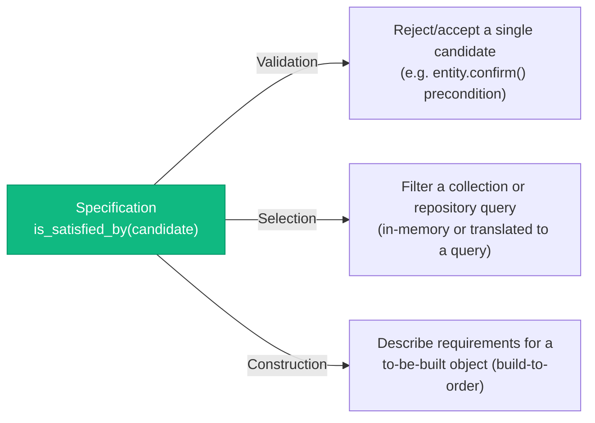

# Specification Pattern

> Sources:
> - [Domain-Driven Design: The Blue Book](https://www.domainlanguage.com/ddd/blue-book/) — Eric Evans (2003), ch. 9
> - [Specifications](https://www.martinfowler.com/apsupp/spec.pdf) — Eric Evans & Martin Fowler (2002)
> - [Implementing Domain-Driven Design](https://openlibrary.org/works/OL17392277W) — Vaughn Vernon (2013)

A **Specification** wraps a business rule or predicate ("is this candidate valid /
selected / needed?") into its own object instead of scattering the same `if` chain
across a validation method, a query, and a factory. It answers one question:
`is_satisfied_by(candidate) -> bool`.

## When to Use (and When NOT to)

| Use When                                                          | Skip When                                       |
| ------------------------------------------------------------------ | ------------------------------------------------ |
| The same business rule is checked in 2+ places (validate, select, build-to-order) | The rule is used exactly once, inline            |
| The rule combines multiple conditions with AND/OR/NOT logic        | It's a single attribute comparison               |
| The rule needs to be named and unit-tested on its own              | It's trivial enough that naming it adds no clarity |
| Domain experts have a name for the rule ("OverdueOrder", "EligibleForDiscount") | There's no ubiquitous-language term for it — you're inventing one just to have a class |

**Default to a plain `if` or a query filter first.** A Specification earns its place
only when the *same* predicate is reused across contexts (e.g. "is this order
overdue?" checked when confirming an order, when selecting overdue orders for a batch
job, and when a Domain Service decides whether to build a follow-up task). One-off
checks that stay one-off are not a smell — don't pre-build a Specification for a rule
that might get reused someday.

## The Three Uses (Evans)



1. **Validation** — check a candidate object satisfies a rule before an operation proceeds.
2. **Selection** — pick matching objects out of a collection (in-memory) or a repository.
3. **Construction (build-to-order)** — describe what a newly created object must satisfy, so a factory can build exactly that.

A single Specification class can serve all three; which use you're in depends only on
*how the caller uses the boolean/filter*, not on the Specification's own code.

## Where It Lives

Specifications are domain objects — pure predicates over Entities/Value
Objects/Aggregates, with no I/O and no framework dependency, same rule as everything
else in `domain/`.

```
app/domain/
└── order/
    ├── entity.py
    ├── value_objects.py
    └── specifications/
        ├── __init__.py
        ├── base.py                  # ISpecification[T] Protocol + composables
        └── overdue_order_spec.py    # concrete specification(s)
```

## Pattern

```python
# app/domain/specifications/base.py
"""Base Specification protocol and composable combinators."""

from typing import Protocol


class ISpecification[T](Protocol):
    """A reusable, named business predicate over a candidate of type T."""

    def is_satisfied_by(self, candidate: T) -> bool:
        """Return True if candidate satisfies this specification.

        Args:
            candidate: The object being evaluated

        Returns:
            True if the candidate matches the rule, False otherwise
        """
        ...

    def and_(self, other: "ISpecification[T]") -> "ISpecification[T]":
        """Combine with another specification via logical AND."""
        return _AndSpecification(self, other)

    def or_(self, other: "ISpecification[T]") -> "ISpecification[T]":
        """Combine with another specification via logical OR."""
        return _OrSpecification(self, other)

    def not_(self) -> "ISpecification[T]":
        """Negate this specification."""
        return _NotSpecification(self)


class Specification[T]:
    """Base class providing the AND/OR/NOT combinators via composition.

    Concrete specifications inherit this and implement only
    `is_satisfied_by` — the combinators are free.
    """

    def is_satisfied_by(self, candidate: T) -> bool:
        raise NotImplementedError

    def and_(self, other: "Specification[T]") -> "Specification[T]":
        return _AndSpecification(self, other)

    def or_(self, other: "Specification[T]") -> "Specification[T]":
        return _OrSpecification(self, other)

    def not_(self) -> "Specification[T]":
        return _NotSpecification(self)


class _AndSpecification[T](Specification[T]):
    def __init__(self, left: Specification[T], right: Specification[T]) -> None:
        self._left = left
        self._right = right

    def is_satisfied_by(self, candidate: T) -> bool:
        return self._left.is_satisfied_by(candidate) and self._right.is_satisfied_by(candidate)


class _OrSpecification[T](Specification[T]):
    def __init__(self, left: Specification[T], right: Specification[T]) -> None:
        self._left = left
        self._right = right

    def is_satisfied_by(self, candidate: T) -> bool:
        return self._left.is_satisfied_by(candidate) or self._right.is_satisfied_by(candidate)


class _NotSpecification[T](Specification[T]):
    def __init__(self, spec: Specification[T]) -> None:
        self._spec = spec

    def is_satisfied_by(self, candidate: T) -> bool:
        return not self._spec.is_satisfied_by(candidate)
```

```python
# app/domain/specifications/overdue_order_spec.py
"""Specifications for Order overdue/eligibility rules."""

from datetime import datetime, timezone

from app.domain.entities import Order
from app.domain.specifications.base import Specification


class OverdueOrderSpecification(Specification[Order]):
    """An order is overdue if confirmed more than 48h ago and not yet shipped."""

    def is_satisfied_by(self, candidate: Order) -> bool:
        if candidate.confirmed_at is None:
            return False
        hours_since_confirm = (datetime.now(timezone.utc) - candidate.confirmed_at.value).total_seconds() / 3600
        return hours_since_confirm > 48 and candidate.status != "shipped"


class HighValueOrderSpecification(Specification[Order]):
    """An order qualifies as high-value above a configurable threshold."""

    def __init__(self, threshold: float = 500.0) -> None:
        self._threshold = threshold

    def is_satisfied_by(self, candidate: Order) -> bool:
        return candidate.total.amount >= self._threshold


# Composition — no new class needed for "overdue AND high-value"
overdue_and_high_value = OverdueOrderSpecification().and_(HighValueOrderSpecification())
```

### Use 1 — Validation

```python
# Inside an Entity method or a Domain Service, guard a transition
class Order(Entity["Order"]):
    def escalate(self, spec: ISpecification["Order"]) -> None:
        """Escalate the order if it satisfies the given specification."""
        if not spec.is_satisfied_by(self):
            raise OrderNotEligibleForEscalationError(self.id)
        self.escalated = True
```

### Use 2 — Selection (in-memory)

```python
# A Domain Service filtering an already-loaded collection
class EscalationService:
    def __init__(self, spec: ISpecification[Order]) -> None:
        self._spec = spec

    def find_orders_to_escalate(self, orders: list[Order]) -> list[Order]:
        return [o for o in orders if self._spec.is_satisfied_by(o)]
```

### Use 2 — Selection (repository-translated)

Translating a Specification straight into a SQL/ORM filter (a visitor per spec, or a
`to_sqlalchemy_filter()` method) is a legitimate but heavier technique — **only worth it
when the same rule genuinely needs to run both in-memory and as a query**. Don't reach
for it by default:

```python
# domain/repository/i_order_repository.py — still a Protocol, still domain
class IOrderRepository(Protocol):
    async def find_satisfying(self, spec: ISpecification[Order]) -> list[Order]: ...


# infrastructure/db/repository/order_repository.py
class OrderRepository:
    async def find_satisfying(self, spec: ISpecification[Order]) -> list[Order]:
        # Simplest correct implementation: load candidates, filter in Python.
        # Only optimize into a translated SQL WHERE clause once this path is a
        # measured bottleneck — premature query-translation is the anti-pattern below.
        candidates = await self._load_candidates()
        return [o for o in candidates if spec.is_satisfied_by(o)]
```

**This is not the same thing as CQRS read-side filtering.** A query handler's filter
params (`status`, `customer_id`, pagination) belong on the `Query` DTO and get pushed
straight into a read-repository's SQL, per `CQRS-EVENTS.md` — those aren't reusable
domain business rules, they're request shape. Don't wrap ordinary query filters in a
Specification just for consistency; reserve Specification for a *named business rule*
that Domain code also needs to evaluate outside the query path.

### Use 3 — Construction (build-to-order)

```python
class OrderFactory:
    """Builds an order guaranteed to satisfy a given specification."""

    def create_matching(
        self,
        customer_id: CustomerId,
        spec: ISpecification[Order],
    ) -> Order:
        order = Order.create(customer_id=customer_id)
        if not spec.is_satisfied_by(order):
            raise ValueError("Constructed order does not satisfy required specification")
        return order
```

## Testing

Specifications are pure predicates — no I/O, no mocking, trivially parametrized:

```python
import pytest

from app.domain.specifications.overdue_order_spec import OverdueOrderSpecification


@pytest.mark.parametrize(
    "hours_since_confirm, status, expected",
    [
        (49, "confirmed", True),
        (47, "confirmed", False),
        (72, "shipped", False),
    ],
)
def test_overdue_order_specification(hours_since_confirm, status, expected, make_order):
    order = make_order(hours_since_confirm=hours_since_confirm, status=status)
    assert OverdueOrderSpecification().is_satisfied_by(order) is expected
```

See `references/TESTING.md` for the fixture-building conventions this project uses for
domain objects.

## Anti-Patterns

| Anti-Pattern                              | Problem                                                    | Fix                                                          |
| ------------------------------------------ | ----------------------------------------------------------- | -------------------------------------------------------------- |
| **Specification for a one-off check**      | Adds indirection with no reuse payoff                       | Keep it a plain `if`/boolean expression until reused          |
| **Specification wrapping a query filter**  | Confuses CQRS read-side shape with a domain business rule   | Query params stay on the `Query` DTO; see CQRS-EVENTS.md      |
| **Specification with I/O inside**          | `is_satisfied_by` calling a repository/HTTP client breaks purity and testability | Pass already-loaded data in; keep the spec pure               |
| **Giant one-class specification**          | One `is_satisfied_by` with unrelated AND'd conditions bolted in ad hoc | Split into small named specs, compose with `.and_()`/`.or_()` |
| **Naming without ubiquitous language**     | `Spec1`, `CheckA` — no domain meaning                        | Name it what the domain expert calls the rule, or don't extract it |

## Reference Documentation

- [DDD-TACTICAL.md](DDD-TACTICAL.md) — Entity, Value Object, Aggregate, Repository, Domain Service, UoW, Factory
- [CQRS-EVENTS.md](CQRS-EVENTS.md) — why query filters are not Specifications
- [TESTING.md](TESTING.md) — domain object test fixtures
