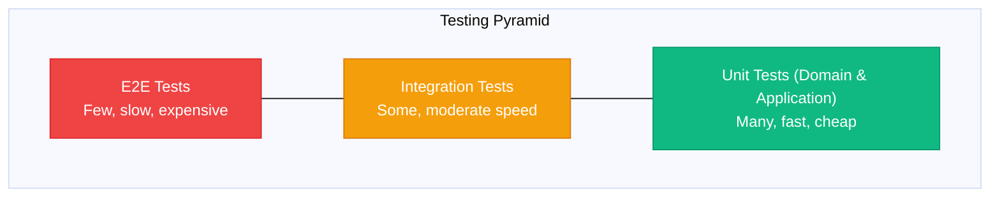

# Testing Patterns

> Sources:
> - [The Clean Architecture](https://blog.cleancoder.com/uncle-bob/2012/08/13/the-clean-architecture.html) — Robert C. Martin
> - [Hexagonal Architecture](https://alistair.cockburn.us/hexagonal-architecture/) — Alistair Cockburn
> - [Unit Testing](https://martinfowler.com/bliki/UnitTest.html) — Martin Fowler
> - [Test Pyramid](https://martinfowler.com/bliki/TestPyramid.html) — Martin Fowler

Testing strategies for Clean Architecture + DDD + Hexagonal systems in Python.

## Testing Pyramid



---

## Unit Tests

### Domain Layer Tests

Test business logic in isolation. **No mocks needed**—domain has no dependencies.

```python
# tests/unit/domain/order/test_order.py
import pytest
from datetime import datetime, timezone

from domain.order.order import Order, OrderStatusEnum
from domain.order.value_objects import OrderId, CustomerId, Quantity, Money, ProductId
from domain.order.events import OrderCreated, OrderConfirmed
from domain.order.errors import (
    InvalidOrderStateError,
    InvalidQuantityError,
    EmptyOrderError,
)


class TestOrder:
    """Unit tests for Order aggregate."""

    def test_create_order_with_draft_status(self):
        # Arrange
        customer_id = CustomerId("cust-123")

        # Act
        order = Order.create(customer_id)

        # Assert
        assert order.status == OrderStatusEnum.DRAFT
        assert order.customer_id == customer_id
        assert len(order.items) == 0

    def test_create_order_emits_order_created_event(self):
        # Arrange
        customer_id = CustomerId("cust-123")

        # Act
        order = Order.create(customer_id)

        # Assert
        assert len(order.domain_events) == 1
        assert isinstance(order.domain_events[0], OrderCreated)

    def test_add_item_to_order(self):
        # Arrange
        order = self._create_draft_order()
        product_id = ProductId("prod-123")
        quantity = 2
        price = Money(10.0, "USD")

        # Act
        order.add_item(product_id, quantity, price)

        # Assert
        assert len(order.items) == 1
        assert order.items[0].product_id == product_id
        assert order.items[0].quantity.value == quantity

    def test_add_item_increases_quantity_for_existing_product(self):
        # Arrange
        order = self._create_draft_order()
        product_id = ProductId("prod-123")
        price = Money(10.0, "USD")

        # Act
        order.add_item(product_id, 2, price)
        order.add_item(product_id, 3, price)

        # Assert
        assert len(order.items) == 1
        assert order.items[0].quantity.value == 5

    def test_add_item_raises_when_order_is_cancelled(self):
        # Arrange
        order = self._create_cancelled_order()

        # Act & Assert
        with pytest.raises(InvalidOrderStateError):
            order.add_item(ProductId("prod-123"), 1, Money(10.0, "USD"))

    def test_add_item_raises_when_quantity_is_zero(self):
        # Arrange
        order = self._create_draft_order()

        # Act & Assert
        with pytest.raises(InvalidQuantityError):
            order.add_item(ProductId("prod-123"), 0, Money(10.0, "USD"))

    def test_confirm_changes_status_to_confirmed(self):
        # Arrange
        order = self._create_order_with_items()

        # Act
        order.confirm()

        # Assert
        assert order.status == OrderStatusEnum.CONFIRMED

    def test_confirm_emits_order_confirmed_event(self):
        # Arrange
        order = self._create_order_with_items()

        # Act
        order.confirm()

        # Assert
        confirmed_events = [
            e for e in order.domain_events if isinstance(e, OrderConfirmed)
        ]
        assert len(confirmed_events) == 1

    def test_confirm_raises_when_order_is_empty(self):
        # Arrange
        order = self._create_draft_order()

        # Act & Assert
        with pytest.raises(EmptyOrderError):
            order.confirm()

    def test_confirm_raises_when_already_confirmed(self):
        # Arrange
        order = self._create_confirmed_order()

        # Act & Assert
        with pytest.raises(InvalidOrderStateError):
            order.confirm()

    def test_total_calculates_sum_of_all_items(self):
        # Arrange
        order = self._create_draft_order()
        order.add_item(ProductId("p1"), 2, Money(10.0, "USD"))
        order.add_item(ProductId("p2"), 1, Money(25.0, "USD"))

        # Act
        total = order.total

        # Assert
        assert total.amount == 45.0  # 2*10 + 1*25

    def test_total_returns_zero_for_empty_order(self):
        # Arrange
        order = self._create_draft_order()

        # Act
        total = order.total

        # Assert
        assert total.amount == 0.0

    # Test helpers
    def _create_draft_order(self) -> Order:
        return Order.create(CustomerId("cust-123"))

    def _create_order_with_items(self) -> Order:
        order = self._create_draft_order()
        order.add_item(ProductId("prod-123"), 1, Money(10.0, "USD"))
        order.set_shipping_address(self._create_test_address())
        return order

    def _create_confirmed_order(self) -> Order:
        order = self._create_order_with_items()
        order.confirm()
        return order

    def _create_cancelled_order(self) -> Order:
        order = self._create_order_with_items()
        order.cancel("Test cancellation")
        return order

    def _create_test_address(self):
        from domain.order.value_objects import Address
        return Address(
            street="123 Main St",
            city="New York",
            postal_code="10001",
            country="US",
        )
```

### Value Object Tests

```python
# tests/unit/domain/shared/test_money.py
import pytest
from domain.shared.money import Money


class TestMoney:
    """Unit tests for Money value object."""

    def test_create_money_with_valid_amount(self):
        # Act
        money = Money(10.50, "USD")

        # Assert
        assert money.amount == 10.50
        assert money.currency == "USD"

    def test_create_raises_for_negative_amount(self):
        # Act & Assert
        with pytest.raises(ValueError, match="cannot be negative"):
            Money(-1.0, "USD")

    def test_add_two_money_values_with_same_currency(self):
        # Arrange
        a = Money(10.0, "USD")
        b = Money(20.0, "USD")

        # Act
        result = a.add(b)

        # Assert
        assert result.amount == 30.0
        assert result.currency == "USD"

    def test_add_raises_for_different_currencies(self):
        # Arrange
        usd = Money(10.0, "USD")
        eur = Money(10.0, "EUR")

        # Act & Assert
        with pytest.raises(ValueError, match="Cannot add different currencies"):
            usd.add(eur)

    def test_equality_with_same_amount_and_currency(self):
        # Arrange
        a = Money(10.0, "USD")
        b = Money(10.0, "USD")

        # Act & Assert
        assert a == b

    def test_not_equal_with_different_amount(self):
        # Arrange
        a = Money(10.0, "USD")
        b = Money(20.0, "USD")

        # Act & Assert
        assert a != b

    def test_immutability(self):
        # Arrange
        money = Money(10.0, "USD")

        # Act & Assert
        with pytest.raises(AttributeError):
            money.amount = 20.0  # Should raise because frozen=True
```

### Application Layer Tests

Test use cases with mocked ports.

```python
# tests/unit/application/orders/test_create_order_handler.py
import pytest
from typing import Any

from app.application.orders.create_order.handler import CreateOrderHandler
from app.application.orders.create_order.command import CreateOrderCommand
from app.domain.order.entity import Order
from app.domain.product.entity import Product


@pytest.mark.asyncio
class TestCreateOrderHandler:
    """Unit tests for CreateOrderHandler."""

    async def test_creates_order_with_items_and_saves(self):
        # Arrange
        uow = MockOrderUoW()
        uow.products.add_product(self._create_test_product("prod-1", 10.0))
        uow.products.add_product(self._create_test_product("prod-2", 20.0))

        handler = CreateOrderHandler(uow)

        command = CreateOrderCommand(
            customer_id="cust-123",
            items=[
                {"product_id": "prod-1", "quantity": 2},
                {"product_id": "prod-2", "quantity": 1},
            ],
        )

        # Act
        result = await handler.handle(command)

        # Assert
        assert result.id is not None
        assert len(result.items) == 2
        assert result.total == 40.0  # 2*10 + 1*20

    async def test_emits_domain_events(self):
        # Arrange
        uow = MockOrderUoW()
        uow.products.add_product(self._create_test_product("prod-1", 10.0))

        handler = CreateOrderHandler(uow)

        command = CreateOrderCommand(
            customer_id="cust-123",
            items=[{"product_id": "prod-1", "quantity": 1}],
        )

        # Act
        result = await handler.handle(command)

        # Assert
        saved_order = await uow.orders.find_by_id(result.id)
        assert len(saved_order.domain_events) >= 1

    async def test_raises_when_product_not_found(self):
        # Arrange
        uow = MockOrderUoW()
        handler = CreateOrderHandler(uow)

        command = CreateOrderCommand(
            customer_id="cust-123",
            items=[{"product_id": "nonexistent", "quantity": 1}],
        )

        # Act & Assert
        with pytest.raises(ProductNotFoundError):
            await handler.handle(command)

    # Test helpers
    def _create_test_product(self, product_id: str, price: float) -> Product:
        return Product(
            id=product_id,
            name=f"Product {product_id}",
            price=price,
            currency="USD",
            stock=100,
        )


# Mock implementations
class MockOrderRepository:
    """Mock implementation of order repository for testing."""

    def __init__(self):
        self._orders: dict[str, Order] = {}

    async def find_by_id(self, order_id: str) -> Order | None:
        return self._orders.get(order_id)

    async def save(self, order: Order) -> None:
        self._orders[order.id] = order

    async def delete(self, order: Order) -> None:
        self._orders.pop(order.id, None)


class MockProductRepository:
    """Mock implementation of product repository for testing."""

    def __init__(self):
        self._products: dict[str, Product] = {}

    def add_product(self, product: Product) -> None:
        self._products[product.id] = product

    async def find_by_id(self, product_id: str) -> Product | None:
        return self._products.get(product_id)


class MockOrderUoW:
    """Mock implementation of Unit of Work for testing."""

    def __init__(self):
        self.orders = MockOrderRepository()
        self.products = MockProductRepository()
        self._committed = False

    async def __aenter__(self):
        return self

    async def __aexit__(self, *args):
        pass

    async def commit(self) -> None:
        self._committed = True

    async def rollback(self) -> None:
        pass
```

---

## Integration Tests

Test adapters with real infrastructure (databases, message brokers).

```python
# tests/integration/persistence/sqlalchemy/test_order_repository.py
import pytest
from sqlalchemy.ext.asyncio import create_async_engine, AsyncSession, async_sessionmaker

from app.infrastructure.adapters.driven.persistence.sqlalchemy.order_repository import (
    SqlAlchemyOrderRepository,
)
from app.infrastructure.adapters.driven.persistence.sqlalchemy.models import Base
from app.domain.order.entity import Order


@pytest.fixture
async def db_session():
    """Create a test database session."""
    # Use in-memory SQLite for testing
    engine = create_async_engine(
        "sqlite+aiosqlite:///:memory:",
        echo=True,
    )

    async with engine.begin() as conn:
        await conn.run_sync(Base.metadata.create_all)

    session_factory = async_sessionmaker(
        engine,
        class_=AsyncSession,
        expire_on_commit=False,
    )

    async with session_factory() as session:
        yield session

    async with engine.begin() as conn:
        await conn.run_sync(Base.metadata.drop_all)

    await engine.dispose()


@pytest.mark.asyncio
class TestSqlAlchemyOrderRepository:
    """Integration tests for SqlAlchemyOrderRepository."""

    async def test_persists_and_retrieves_order(self, db_session: AsyncSession):
        # Arrange
        repository = SqlAlchemyOrderRepository(db_session)
        order = Order.create(customer_id="cust-123")
        order.add_item(product_id="prod-1", quantity=2, price=10.0)

        # Act
        await repository.save(order)
        await db_session.commit()

        retrieved = await repository.find_by_id(order.id)

        # Assert
        assert retrieved is not None
        assert retrieved.id == order.id
        assert len(retrieved.items) == 1
        assert retrieved.items[0].quantity == 2

    async def test_updates_existing_order(self, db_session: AsyncSession):
        # Arrange
        repository = SqlAlchemyOrderRepository(db_session)
        order = Order.create(customer_id="cust-123")
        order.add_item(product_id="prod-1", quantity=1, price=10.0)
        await repository.save(order)
        await db_session.commit()

        # Act
        order.add_item(product_id="prod-2", quantity=3, price=20.0)
        await repository.save(order)
        await db_session.commit()

        retrieved = await repository.find_by_id(order.id)

        # Assert
        assert len(retrieved.items) == 2

    async def test_returns_none_for_nonexistent_order(self, db_session: AsyncSession):
        # Arrange
        repository = SqlAlchemyOrderRepository(db_session)

        # Act
        result = await repository.find_by_id("nonexistent-id")

        # Assert
        assert result is None

    async def test_deletes_order(self, db_session: AsyncSession):
        # Arrange
        repository = SqlAlchemyOrderRepository(db_session)
        order = Order.create(customer_id="cust-123")
        await repository.save(order)
        await db_session.commit()

        # Act
        await repository.delete(order)
        await db_session.commit()

        retrieved = await repository.find_by_id(order.id)

        # Assert
        assert retrieved is None
```

### API Integration Tests

```python
# tests/integration/rest/test_orders_router.py
import pytest
from httpx import AsyncClient, ASGITransport
from fastapi import status

from app.infrastructure.adapters.driving.rest.app import create_app


@pytest.fixture
async def client():
    """Create test client with test configuration."""
    app = create_app(environment="test")
    transport = ASGITransport(app=app)

    async with AsyncClient(transport=transport, base_url="http://test") as client:
        yield client


@pytest.mark.asyncio
class TestOrdersRouter:
    """Integration tests for Orders REST API."""

    async def test_create_order_returns_201(self, client: AsyncClient):
        # Arrange
        request_data = {
            "customer_id": "cust-123",
            "items": [
                {"product_id": "prod-1", "quantity": 2},
                {"product_id": "prod-2", "quantity": 1},
            ],
        }

        # Act
        response = await client.post("/api/v1/orders", json=request_data)

        # Assert
        assert response.status_code == status.HTTP_201_CREATED
        data = response.json()
        assert "id" in data
        assert data["customer_id"] == "cust-123"

    async def test_create_order_with_invalid_product_returns_404(
        self, client: AsyncClient
    ):
        # Arrange
        request_data = {
            "customer_id": "cust-123",
            "items": [{"product_id": "nonexistent", "quantity": 1}],
        }

        # Act
        response = await client.post("/api/v1/orders", json=request_data)

        # Assert
        assert response.status_code == status.HTTP_404_NOT_FOUND

    async def test_get_order_returns_order_details(self, client: AsyncClient):
        # Arrange
        create_response = await client.post(
            "/api/v1/orders",
            json={
                "customer_id": "cust-123",
                "items": [{"product_id": "prod-1", "quantity": 2}],
            },
        )
        order_id = create_response.json()["id"]

        # Act
        response = await client.get(f"/api/v1/orders/{order_id}")

        # Assert
        assert response.status_code == status.HTTP_200_OK
        data = response.json()
        assert data["id"] == order_id
        assert len(data["items"]) == 1

    async def test_get_nonexistent_order_returns_404(self, client: AsyncClient):
        # Act
        response = await client.get("/api/v1/orders/nonexistent-id")

        # Assert
        assert response.status_code == status.HTTP_404_NOT_FOUND

    async def test_get_orders_with_pagination(self, client: AsyncClient):
        # Act
        response = await client.get("/api/v1/orders?page=1&page_size=10")

        # Assert
        assert response.status_code == status.HTTP_200_OK
        data = response.json()
        assert "items" in data
        assert "total" in data
        assert "page" in data
```

---

## Architecture Tests

Verify architectural rules are followed using `import-linter`.

```ini
# .importlinter
[importlinter]
root_package = app

[importlinter:contract:domain-independence]
name = Domain layer should not depend on application or infrastructure
type = forbidden
source_modules =
    app.domain
forbidden_modules =
    app.application
    app.infrastructure

[importlinter:contract:application-infrastructure-independence]
name = Application layer should not depend on infrastructure
type = forbidden
source_modules =
    app.application
forbidden_modules =
    app.infrastructure

[importlinter:contract:domain-framework-independence]
name = Domain should have no framework dependencies
type = forbidden
source_modules =
    app.domain
forbidden_modules =
    sqlalchemy
    fastapi
    pydantic
    aio_pika
    httpx
```

```python
# tests/architecture/test_dependency_rules.py
import subprocess
import pytest


class TestArchitectureConstraints:
    """Architecture tests using import-linter."""

    def test_import_linter_passes(self):
        """Test that architectural constraints are enforced."""
        result = subprocess.run(
            ["lint-imports"],
            capture_output=True,
            text=True,
        )

        assert result.returncode == 0, (
            f"Architecture constraints violated:\n{result.stdout}"
        )
```

---

## Test Organization

Match the template's test directory structure:

```
tests/
├── unit/
│   ├── domain/
│   │   ├── order/
│   │   │   ├── test_order.py
│   │   │   ├── test_order_item.py
│   │   │   └── test_value_objects.py
│   │   └── shared/
│   │       ├── test_money.py
│   │       └── test_email.py
│   └── application/
│       └── orders/
│           ├── test_create_order_handler.py
│           ├── test_confirm_order_handler.py
│           └── test_get_orders_handler.py
├── integration/
│   ├── persistence/
│   │   └── sqlalchemy/
│   │       ├── test_order_repository.py
│   │       └── test_order_read_repository.py
│   ├── messaging/
│   │   └── test_rabbitmq_publisher.py
│   └── rest/
│       └── test_orders_router.py
├── e2e/
│   └── test_order_workflow.py
├── architecture/
│   └── test_dependency_rules.py
├── fixtures/
│   ├── order_fixtures.py
│   └── product_fixtures.py
└── conftest.py
```

---

## Test Fixtures & Builders

```python
# tests/fixtures/order_fixtures.py
from app.domain.order.entity import Order
from app.domain.order.value_objects import Address


class OrderBuilder:
    """Test builder for Order aggregate."""

    def __init__(self):
        self._customer_id = "default-customer"
        self._items: list = []
        self._should_confirm = False
        self._shipping_address: Address | None = None

    def with_customer(self, customer_id: str) -> "OrderBuilder":
        self._customer_id = customer_id
        return self

    def with_item(
        self, product_id: str, quantity: int, price: float
    ) -> "OrderBuilder":
        self._items.append(
            {
                "product_id": product_id,
                "quantity": quantity,
                "price": price,
            }
        )
        return self

    def with_shipping_address(self, address: Address) -> "OrderBuilder":
        self._shipping_address = address
        return self

    def confirmed(self) -> "OrderBuilder":
        self._should_confirm = True
        return self

    def build(self) -> Order:
        order = Order.create(customer_id=self._customer_id)

        for item in self._items:
            order.add_item(
                product_id=item["product_id"],
                quantity=item["quantity"],
                price=item["price"],
            )

        if self._shipping_address:
            order.set_shipping_address(self._shipping_address)

        if self._should_confirm:
            order.confirm()

        order.clear_domain_events()  # Clear events from building
        return order


class AddressBuilder:
    """Test builder for Address value object."""

    def __init__(self):
        self._street = "123 Main St"
        self._city = "New York"
        self._postal_code = "10001"
        self._country = "US"

    def with_street(self, street: str) -> "AddressBuilder":
        self._street = street
        return self

    def with_city(self, city: str) -> "AddressBuilder":
        self._city = city
        return self

    def build(self) -> Address:
        return Address(
            street=self._street,
            city=self._city,
            postal_code=self._postal_code,
            country=self._country,
        )


# Usage in tests
class TestOrderBuilderExample:
    def test_builder_creates_order_with_total(self):
        # Arrange & Act
        order = (
            OrderBuilder()
            .with_customer("cust-123")
            .with_item("prod-1", 2, 10.0)
            .with_item("prod-2", 1, 25.0)
            .with_shipping_address(AddressBuilder().build())
            .confirmed()
            .build()
        )

        # Assert
        assert order.total == 45.0
```

---

## pytest Configuration

```toml
# pyproject.toml
[tool.pytest.ini_options]
testpaths = ["tests"]
python_files = ["test_*.py"]
python_classes = ["Test*"]
python_functions = ["test_*"]
asyncio_mode = "auto"
asyncio_default_fixture_loop_scope = "function"

markers = [
    "unit: Unit tests (fast, no external dependencies)",
    "integration: Integration tests (database, message broker)",
    "e2e: End-to-end tests (full system)",
    "slow: Slow running tests",
]

# Coverage settings
addopts = [
    "--cov=app",
    "--cov-report=html",
    "--cov-report=term-missing:skip-covered",
    "--cov-report=xml",
    "--cov-fail-under=80",
    "-v",
    "--strict-markers",
    "--tb=short",
]

# Filter warnings
filterwarnings = [
    "error",
    "ignore::DeprecationWarning",
]
```

```python
# tests/conftest.py
import pytest
import asyncio
from typing import AsyncGenerator

from sqlalchemy.ext.asyncio import (
    AsyncSession,
    create_async_engine,
    async_sessionmaker,
)

from app.infrastructure.adapters.driven.persistence.sqlalchemy.models import Base


@pytest.fixture(scope="session")
def event_loop():
    """Create event loop for async tests."""
    try:
        loop = asyncio.get_running_loop()
    except RuntimeError:
        loop = asyncio.new_event_loop()
    yield loop
    loop.close()


@pytest.fixture
async def db_session() -> AsyncGenerator[AsyncSession, None]:
    """Provide database session for tests."""
    engine = create_async_engine(
        "sqlite+aiosqlite:///:memory:",
        echo=False,
    )

    async with engine.begin() as conn:
        await conn.run_sync(Base.metadata.create_all)

    session_factory = async_sessionmaker(
        engine,
        class_=AsyncSession,
        expire_on_commit=False,
    )

    async with session_factory() as session:
        yield session

    async with engine.begin() as conn:
        await conn.run_sync(Base.metadata.drop_all)

    await engine.dispose()
```

---

## Running Tests

```bash
# Run all tests
pytest

# Run unit tests only
pytest tests/unit

# Run with markers
pytest -m unit
pytest -m integration
pytest -m "not slow"

# Run with coverage
pytest --cov=app --cov-report=html

# Run specific test file
pytest tests/unit/domain/order/test_order.py

# Run specific test class
pytest tests/unit/domain/order/test_order.py::TestOrder

# Run specific test method
pytest tests/unit/domain/order/test_order.py::TestOrder::test_create_order_with_draft_status

# Run with verbose output
pytest -v

# Run with output capture disabled (see print statements)
pytest -s

# Run in parallel (requires pytest-xdist)
pytest -n auto

# Run architecture tests
lint-imports

# Run tests and watch for changes (requires pytest-watch)
ptw
```

---

## Key Testing Principles

1. **Test behavior, not implementation** - Focus on what, not how
2. **Domain tests need no mocks** - Domain layer is pure
3. **Mock at port boundaries** - Application tests mock driven ports (Protocols)
4. **Integration tests use real infra** - Test actual database, message broker
5. **Fast unit tests, slower integration** - Run unit tests frequently
6. **Test business rules in domain** - Not in application or infrastructure
7. **Use builders for test data** - Make tests readable and maintainable
