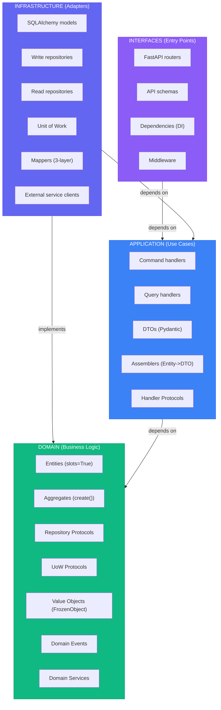
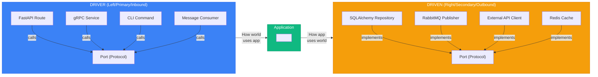

# Quick Reference Cheatsheet (Python)

> See [SKILL.md](../SKILL.md#sources) for full source list.

## Code Standards

### Documentation Requirements

**CRITICAL:** All Python files in this template MUST follow these documentation standards:

1. **Module Docstrings** - Every `.py` file must have a module-level docstring at the top:
   ```python
   """Brief description of what this module contains."""
   ```

2. **Class Docstrings** - Every class must have a docstring:
   ```python
   class Order:
       """Brief description of the class.

       Attributes:
           id: Description of id attribute
           status: Description of status attribute
       """
   ```

3. **Method/Function Docstrings** - All public methods and functions must have docstrings:
   ```python
   def create_order(customer_id: str) -> Order:
       """Create a new order for a customer.

       Args:
           customer_id: The unique identifier of the customer

       Returns:
           The newly created Order instance

       Raises:
           ValueError: If customer_id is invalid
       """
   ```

4. **Type Hints** - Always use type hints for parameters and return values
5. **Google Style** - Use Google-style docstrings (Args, Returns, Raises, Attributes)

### Modern Python Syntax

**CRITICAL:** This template uses Python 3.12+ features. Always use modern syntax:

1. **Generic Syntax** - Use `[T]` NOT `Generic[T]`:
   ```python
   # ✅ CORRECT - Modern syntax (PEP 695)
   class Entity[T]:
       pass

   class IHandler[TCommand, TResult](Protocol):
       pass

   # ❌ WRONG - Old syntax
   from typing import Generic, TypeVar
   T = TypeVar("T")
   class Entity(Generic[T]):
       pass
   ```

2. **Type Unions** - Use `|` NOT `Union`:
   ```python
   # ✅ CORRECT
   def find(id: str) -> Order | None:
       pass

   # ❌ WRONG
   from typing import Union, Optional
   def find(id: str) -> Optional[Order]:
       pass
   ```

3. **FrozenObject** - Use Pydantic BaseModel, NOT dataclass:
   ```python
   # ✅ CORRECT
   from pydantic import BaseModel, ConfigDict

   class ValueObject(BaseModel):
       model_config = ConfigDict(frozen=True, from_attributes=True)

   # ❌ WRONG
   from dataclasses import dataclass

   @dataclass(frozen=True)
   class ValueObject:
       pass
   ```

---

## Layer Summary



*Dependencies point inward*

---

## Quick Decision Trees

### "Where does this code go?"

```
Is it a business rule or constraint?
├── YES → Domain layer
└── NO ↓

Is it orchestrating a use case?
├── YES → Application layer
└── NO ↓

Is it dealing with external systems (DB, API, UI)?
├── YES → Infrastructure layer
└── NO → Reconsider; probably domain
```

### "Entity or Value Object?"

```
Does it have a unique identity that persists?
├── YES → Entity
└── NO ↓

Is it defined entirely by its attributes?
├── YES → Value Object
└── NO → Probably an Entity
```

### "Aggregate boundary?"

```
Must these objects change together atomically?
├── YES → Same aggregate
└── NO ↓

Can one exist without the other?
├── YES → Different aggregates (reference by ID)
└── NO → Probably same aggregate
```

### "Domain Service or Entity method?"

```
Does it naturally belong to one entity?
├── YES → Entity method
└── NO ↓

Does it require multiple aggregates?
├── YES → Domain Service
└── NO ↓

Is it stateless business logic?
├── YES → Domain Service
└── NO → Reconsider placement
```

---

## Common Patterns Quick Reference

### Pattern Selection Guide

| Pattern | When to Use | Template Class |
|---------|-------------|----------------|
| **FrozenObject** | Value objects (immutable) | `class Money(FrozenObject):` |
| **Entity** | Domain entities with identity | `@dataclass(slots=True, kw_only=True)` |
| **Aggregate Root** | Consistency boundary | `@dataclass(slots=True, kw_only=True)` + `create()` |
| **Command Handler** | Write operations | `IHandler[CreateOrderCommand, OrderDto]` |
| **Query Handler** | Read operations | Returns `PaginationDto[T]` or `T` |
| **Unit of Work** | Transaction management | `async with self._uow as uow:` |
| **Mapper** | DB Model <-> Entity | `OrderMapper.to_entity(model)` / `OrderMapper.to_orm(entity)` |
| **ReadMapper** | DB Model -> DTO (skips Entity) | `OrderReadMapper.to_dto(model)` |
| **Assembler** | Entity/VO -> DTO | `OrderAssembler.to_dto(order)` |
| **ApiMapper** | DTO -> Response (exception, not default) | `OrderApiMapper.to_schema(dto)` |
| **Read Repository** | Optimized queries | Returns DTOs directly |
| **Write Repository** | Persistence | Part of UoW, works with entities |

### Value Object Template

```python
"""Money value object module."""

from pydantic import field_validator
from app.domain.value_objects.base import ValueObject


class Money(ValueObject):
    """Money value object representing an amount with currency.

    Attributes:
        amount: The monetary amount (must be non-negative)
        currency: The currency code (e.g., "USD", "EUR")
    """
    amount: float
    currency: str

    @field_validator("amount")
    @classmethod
    def validate_amount(cls, v: float) -> float:
        """Validate that amount is non-negative.

        Args:
            v: The amount to validate

        Returns:
            The validated amount

        Raises:
            ValueError: If amount is negative
        """
        if v < 0:
            raise ValueError("Money amount cannot be negative")
        return v

    @classmethod
    def zero(cls, currency: str = "USD") -> "Money":
        """Create a zero money value.

        Args:
            currency: The currency code (defaults to USD)

        Returns:
            Money instance with zero amount
        """
        return cls(amount=0.0, currency=currency)

    def add(self, other: "Money") -> "Money":
        """Add two money values with the same currency.

        Args:
            other: The money value to add

        Returns:
            New Money instance with the sum

        Raises:
            ValueError: If currencies don't match
        """
        if self.currency != other.currency:
            raise ValueError(f"Cannot add {self.currency} and {other.currency}")
        return Money(amount=self.amount + other.amount, currency=self.currency)

    def multiply(self, factor: float) -> "Money":
        """Multiply money by a numeric factor.

        Args:
            factor: The multiplication factor

        Returns:
            New Money instance with the result
        """
        return Money(amount=self.amount * factor, currency=self.currency)
```

### Entity Template

```python
"""Order item entity module."""

import abc
from dataclasses import dataclass
from typing import Any
from uuid import UUID, uuid4

from .value_objects import Quantity, ProductId


@dataclass(slots=True, kw_only=True)
class OrderItem:
    """Order item entity representing a product in an order.

    Attributes:
        id: Unique identifier for the order item
        product_id: Reference to the product
        quantity: Quantity of the product ordered
    """
    id: UUID
    product_id: ProductId
    quantity: Quantity

    @classmethod
    def create(cls, product_id: ProductId, quantity: Quantity) -> "OrderItem":
        """Create a new order item with generated UUID.

        Args:
            product_id: The product identifier
            quantity: The quantity ordered

        Returns:
            New OrderItem instance
        """
        return cls(id=uuid4(), product_id=product_id, quantity=quantity)

    def __eq__(self, other: object) -> bool:
        if not isinstance(other, OrderItem):
            return False
        return self.id == other.id

    def __hash__(self) -> int:
        return hash(self.id)


# Base Entity Pattern (app/domain/entities/base.py)
"""Base entity class for domain entities."""


@dataclass(slots=True, kw_only=True)
class Entity[T]:
    """Base class for domain entities with generic type support.

    Uses modern Python 3.12+ generic syntax with [T].
    All entities must implement the create() classmethod.
    """

    @classmethod
    @abc.abstractmethod
    def create(cls, **kwargs: Any) -> T:
        """Factory method to create entity instances.

        Must be implemented by all entity subclasses.
        """
        ...
```

### Aggregate Root Template

```python
"""Order aggregate root module."""

from dataclasses import dataclass, field
from enum import Enum
from uuid import UUID, uuid4

from ..shared.aggregate_root import AggregateRoot
from .events import OrderCreated, OrderConfirmed
from .value_objects import CustomerId, OrderId, Money, Quantity, ProductId
from .entity import OrderItem


class OrderStatusEnum(Enum):
    """Order status enumeration."""
    DRAFT = "draft"
    CONFIRMED = "confirmed"
    SHIPPED = "shipped"
    CANCELLED = "cancelled"


@dataclass(slots=True, kw_only=True)
class Order(AggregateRoot[OrderId]):
    """Order aggregate root managing order lifecycle and invariants.

    Attributes:
        id: Unique order identifier
        customer_id: Reference to the customer
        status: Current order status
        _items: Internal list of order items
    """
    id: OrderId
    customer_id: CustomerId
    status: OrderStatusEnum = OrderStatusEnum.DRAFT
    _items: list[OrderItem] = field(default_factory=list)

    @classmethod
    def create(cls, customer_id: CustomerId) -> "Order":
        """Create a new order and raise OrderCreated event.

        Args:
            customer_id: The customer placing the order

        Returns:
            New Order instance with DRAFT status
        """
        order_id = OrderId(uuid4())
        order = cls(id=order_id, customer_id=customer_id)
        order.add_domain_event(OrderCreated(order_id=order_id, customer_id=customer_id))
        return order

    def add_item(self, product_id: ProductId, quantity: Quantity, price: Money) -> None:
        """Add an item to the order or increase quantity if already exists.

        Args:
            product_id: The product to add
            quantity: The quantity to add
            price: The unit price

        Raises:
            ValueError: If order is cancelled
        """
        self._assert_can_modify()

        existing = next((item for item in self._items if item.product_id == product_id), None)
        if existing:
            existing.increase_quantity(quantity.value)
        else:
            self._items.append(OrderItem.create(product_id=product_id, quantity=quantity))

    def confirm(self) -> None:
        """Confirm the order and raise OrderConfirmed event.

        Raises:
            ValueError: If order is empty or cancelled
        """
        self._assert_can_modify()

        if not self._items:
            raise ValueError("Cannot confirm empty order")

        self.status = OrderStatusEnum.CONFIRMED
        self.add_domain_event(OrderConfirmed(order_id=self.id, total=self.total))

    def _assert_can_modify(self) -> None:
        """Ensure order can be modified.

        Raises:
            ValueError: If order is cancelled
        """
        if self.status == OrderStatusEnum.CANCELLED:
            raise ValueError("Cannot modify cancelled order")

    @property
    def total(self) -> Money:
        """Calculate total order amount.

        Returns:
            Total money amount for all items
        """
        if not self._items:
            return Money.zero()
        return sum((item.subtotal for item in self._items), Money.zero())

    @property
    def items(self) -> tuple[OrderItem, ...]:
        """Get read-only view of order items.

        Returns:
            Immutable tuple of order items
        """
        return tuple(self._items)
```

### Repository Protocol Template (Write)

```python
"""Order repository protocol for write operations."""

from typing import Protocol

from .entity import Order
from .value_objects import OrderId, CustomerId


class OrderRepository(Protocol):
    """Write repository protocol for Order aggregate.

    Used by command handlers for write operations.
    Part of the Unit of Work pattern.

    This protocol defines the contract that repository implementations
    must fulfill. It works with domain entities, not DTOs or database models.
    """

    async def find_by_id(self, id: OrderId) -> Order | None:
        """Find an order by its identifier.

        Args:
            id: The order identifier

        Returns:
            Order entity if found, None otherwise
        """
        ...

    async def save(self, order: Order) -> None:
        """Save or update an order.

        Args:
            order: The order entity to persist
        """
        ...

    async def delete(self, order: Order) -> None:
        """Delete an order.

        Args:
            order: The order entity to delete
        """
        ...
```

### Read Repository Protocol Template

```python
"""Order read repository protocol for queries."""

from typing import Protocol

from ...application.dtos.order_dto import OrderDto
from ...application.dtos.pagination_dto import PaginationDto


class IOrderReadRepository(Protocol):
    """Read repository protocol for Order queries.

    Optimized for read operations, returns DTOs directly.
    Used by query handlers, separate from write model.

    This follows CQRS pattern where read operations bypass
    the domain model for better query performance.
    """

    async def get_order_by_id(self, order_id: str) -> OrderDto | None:
        """Get a single order by ID.

        Args:
            order_id: The order identifier as string

        Returns:
            OrderDto if found, None otherwise
        """
        ...

    async def get_orders(
        self,
        page: int = 1,
        page_size: int = 10,
        customer_id: str | None = None,
    ) -> PaginationDto[OrderDto]:
        """Get paginated list of orders with optional filtering.

        Args:
            page: Page number (1-indexed)
            page_size: Number of items per page
            customer_id: Optional customer ID filter

        Returns:
            Paginated list of OrderDto
        """
        ...

    async def search_orders(self, search_term: str) -> list[OrderDto]:
        """Search orders by term.

        Args:
            search_term: The search query string

        Returns:
            List of matching OrderDto instances
        """
        ...
```

### Command Handler Template

```python
"""Create order command handler module."""

from pydantic import BaseModel

from ...domain.order.entity import Order
from ...domain.order.uow import IOrderUoW
from ..dtos.order_dto import OrderDto
from ..mappers.order_assembler import OrderAssembler
from ..shared.handler import IHandler


class CreateOrderCommand(BaseModel):
    """Command to create a new order.

    Attributes:
        customer_id: The customer identifier
        items: List of items to include in the order
    """
    customer_id: str
    items: list[dict[str, str | int]]


class CreateOrderHandler(IHandler[CreateOrderCommand, OrderDto]):
    """Handler for creating orders.

    Orchestrates the use case of creating a new order,
    persisting it, and returning the result as a DTO.
    """

    def __init__(self, uow: IOrderUoW) -> None:
        """Initialize handler with Unit of Work.

        Args:
            uow: The order unit of work for transaction management
        """
        self._uow = uow

    async def execute(self, command: CreateOrderCommand) -> OrderDto:
        """Execute the create order command.

        Args:
            command: The create order command with required data

        Returns:
            OrderDto representing the created order

        Raises:
            DomainException: If order creation violates business rules
        """
        async with self._uow as uow:
            order = Order.create(**command.model_dump())
            await uow.orders.save(order)
            await uow.commit()

        return OrderAssembler.to_dto(order)
```

### Query Handler Template

```python
"""Get orders query handler module."""

from pydantic import BaseModel, Field

from ...infrastructure.read_model.order_read_repository import IOrderReadRepository
from ..dtos.order_dto import OrderDto
from ..dtos.pagination_dto import PaginationDto


class GetOrdersQuery(BaseModel):
    """Query to retrieve paginated orders.

    Attributes:
        page: Page number (1-indexed)
        page_size: Number of items per page
        customer_id: Optional customer ID filter
    """
    page: int = Field(default=1, ge=1)
    page_size: int = Field(default=10, ge=1, le=100)
    customer_id: str | None = None


class GetOrdersHandler:
    """Handler for retrieving orders.

    Executes read-only queries using the read repository.
    Bypasses domain model for optimized read performance.
    """

    def __init__(self, repository: IOrderReadRepository) -> None:
        """Initialize handler with read repository.

        Args:
            repository: The order read repository for queries
        """
        self._repository = repository

    async def handle(self, query: GetOrdersQuery) -> PaginationDto[OrderDto]:
        """Execute the get orders query.

        Args:
            query: The query parameters

        Returns:
            Paginated list of OrderDto instances
        """
        return await self._repository.get_orders(
            page=query.page,
            page_size=query.page_size,
            customer_id=query.customer_id,
        )
```

---

## Port Naming Conventions

| Type | Pattern | Examples |
|------|---------|----------|
| Driver Port | `IHandler[TCommand, TResult]` (Generic Protocol) | `IHandler[CreateOrderCommand, OrderDto]` |
| Driven Port (Repository) | `{Resource}Repository` (Protocol) | `OrderRepository`, `ProductRepository` |
| Driven Port (UoW) | `I{Resource}UoW` (Protocol) | `IOrderUoW`, `IProductUoW` |
| Driven Port (Service) | `{Action}ServiceProtocol` | `PaymentServiceProtocol`, `NotificationServiceProtocol` |
| Driven Port (Gateway) | `{Resource}GatewayProtocol` | `PaymentGatewayProtocol`, `ShippingGatewayProtocol` |
| Read Repository | `I{Resource}ReadRepository` (Protocol) | `IOrderReadRepository`, `ICustomerReadRepository` |

---

## Common Anti-Patterns

| Anti-Pattern | Problem | Solution |
|--------------|---------|----------|
| Anemic Domain | Entities are just dataclasses | Put behavior in entities |
| Repository per table | One repo per DB table | One repo per aggregate |
| Fat Handlers | Business logic in handlers | Move to domain layer |
| Leaky Abstraction | Domain depends on SQLAlchemy | Keep domain pure, use mappers |
| God Aggregate | One massive aggregate | Split into smaller aggregates |
| Cross-Aggregate TX | Modifying multiple in one TX | Use domain events + eventual consistency |
| Direct Layer Skip | Router → Repository | Go through handler layer |
| Mixing Read/Write | Using write repo for queries | Separate read repositories |
| DTO in Domain | Pydantic models in domain | Use value objects and entities |
| Missing UoW | Manual transaction management | Use Unit of Work pattern |
| Mutable Value Objects | Using regular dataclass | Use FrozenObject |
| Wrong Mapper Layer | Mapping in handlers | Use dedicated mapper/assembler classes |

---

## Dependency Rules Matrix

|  | Domain | Application | Infrastructure |
|--|--------|-------------|----------------|
| **Domain** | ✅ | ❌ | ❌ |
| **Application** | ✅ | ✅ | ❌ |
| **Infrastructure** | ✅ | ✅ | ✅ |

✅ = Can depend on
❌ = Cannot depend on

---

## Hexagonal Quick Reference



---

## When to Use / Skip

### Use Clean + DDD + Hexagonal When:

- ✅ Complex business domain with many rules
- ✅ Long-lived system (years of maintenance)
- ✅ Large team (5+ developers)
- ✅ Need to swap infrastructure (DB, broker, etc.)
- ✅ High test coverage required
- ✅ Multiple entry points (API, CLI, events, scheduled jobs)

### Skip When:

- ❌ Simple CRUD application (most applications)
- ❌ Prototype / MVP / throwaway code
- ❌ Small team (1-2 devs)
- ❌ Short-lived project
- ❌ Trivial business logic

### Complexity Ladder (Start Simple)

```
Level 1: Simple layered (Router → Service → Repository)
   ↓ When business rules grow complex
Level 2: Domain model (Entities with behavior)
   ↓ When need multiple entry points
Level 3: Hexagonal (Ports & Adapters)
   ↓ When read/write patterns diverge significantly
Level 4: CQRS (Separate read/write models)
   ↓ When need complete audit trail / temporal queries
Level 5: Event Sourcing (Store events, derive state)
```

**Don't skip levels.** Each level adds complexity. Move up only when you've proven the current level insufficient.

---

## Directory Structure

```
app/
├── utils/                         # Utility classes
│   └── __init__.py                # FrozenObject base class
│
├── core/                          # Core configuration
│
├── domain/                        # Business logic layer
│   └── order/
│       ├── __init__.py
│       ├── entity.py              # Order, OrderItem
│       ├── value_objects.py       # OrderId, Money, etc.
│       ├── events.py              # OrderCreated, etc.
│       ├── repository.py          # OrderRepository (Protocol)
│       ├── uow.py                 # IOrderUoW (Protocol)
│       ├── services.py            # Domain services
│       └── errors.py              # OrderError, etc.
│
├── application/                   # Use case orchestration
│   ├── handlers/
│   │   ├── commands/
│   │   │   ├── create_order_handler.py
│   │   │   └── cancel_order_handler.py
│   │   └── queries/
│   │       ├── get_order_handler.py
│   │       └── get_orders_handler.py
│   ├── dtos/                      # Data transfer objects
│   │   ├── order_dto.py
│   │   └── pagination_dto.py
│   ├── mappers/                    # Entity <-> DTO mapping
│   │   └── order_assembler.py
│   └── shared/
│       └── handler.py             # IHandler protocol
│
├── infrastructure/                # External adapters
│   ├── db/
│   │   ├── models/                # SQLAlchemy models
│   │   │   └── order_model.py
│   │   ├── repository/            # Write repositories
│   │   │   └── order_repository.py
│   │   ├── mappers/               # Three-mapper pattern
│   │   │   └── order_mapper.py
│   │   └── uow.py                 # OrderUoW implementation
│   └── read_model/                # Read-optimized repositories
│       └── order_read_repository.py
│
└── interfaces/                    # Entry points
    └── api/
        └── v1/
            ├── routers/           # FastAPI route handlers
            │   └── order_router.py
            ├── dependencies/      # Dependency injection
            │   └── order_dpd.py
            ├── schemas/           # API request/response models
            │   └── order_schema.py
            └── middleware/        # API middleware
                └── error_handler.py
```

---

## Template-Specific Patterns

### FrozenObject Pattern

```python
# app/utils/__init__.py
"""Utility classes and functions for the application."""

from pydantic import BaseModel, ConfigDict


class FrozenObject(BaseModel):
    """Base class for immutable value objects.

    Provides:
    - Immutability (frozen=True via Pydantic ConfigDict)
    - Automatic validation via Pydantic
    - Serialization/deserialization support
    - Automatic __eq__ and __hash__
    """
    model_config = ConfigDict(frozen=True, from_attributes=True)


# Usage in domain (app/domain/value_objects/email.py)
from pydantic import EmailStr
from .base import ValueObject  # ValueObject inherits from FrozenObject


class Email(ValueObject):
    """Email value object with automatic validation."""
    value: EmailStr

    def __str__(self) -> str:
        return str(self.value)
```

### Four-Mapper Pattern

The template uses a four-layer mapping approach to separate concerns. Every method is
named `to_[destination]` — never `from_x` — so the name always tells you what's being
produced. The fourth tier (`{Entity}ApiMapper`, DTO → Response) is the exception, not
the default: reach for it only when `ResponseSchema.model_validate(dto)` inline in the
router can't express the mapping (real transform logic — nested flattening, computed
fields — not merely "the shapes differ").

```python
# 1. Domain Entity (app/domain/order/entity.py)
"""Order entity module."""

from dataclasses import dataclass
from uuid import UUID


@dataclass(slots=True, kw_only=True)
class Order:
    """Order entity representing a customer order.

    Attributes:
        id: Unique order identifier
        customer_id: Reference to the customer
        total: Total order amount with currency
    """
    id: UUID
    customer_id: UUID
    total: Money


# 2. Database Model (app/infrastructure/db/models/order_model.py)
"""Order database model module."""

from sqlalchemy import Column, String, Numeric
from sqlalchemy.dialects.postgresql import UUID
from app.infrastructure.db.base import Base


class OrderModel(Base):
    """SQLAlchemy model for orders table.

    Maps to the 'orders' table in the database.
    """
    __tablename__ = "orders"

    id = Column(UUID(as_uuid=True), primary_key=True)
    customer_id = Column(UUID(as_uuid=True), nullable=False)
    total_amount = Column(Numeric(10, 2), nullable=False)
    total_currency = Column(String(3), nullable=False)


# 3. DTO (app/application/dtos/order_dto.py)
"""Order data transfer object module."""

from pydantic import BaseModel


class OrderDto(BaseModel):
    """Order DTO for API responses.

    Attributes:
        id: Order identifier as string
        customer_id: Customer identifier as string
        total_amount: Total amount as float
        total_currency: Currency code
    """
    id: str
    customer_id: str
    total_amount: float
    total_currency: str


# 1. Mapper (app/infrastructure/db/mappers/order_mapper.py) — ORM <-> Entity
"""Order mapper for Domain <-> Database conversions."""

from app.domain.order.entity import Order
from app.domain.value_objects.money import Money
from app.infrastructure.db.models.order_model import OrderModel


class OrderMapper:
    """Mapper for converting between Order entity and OrderModel."""

    @staticmethod
    def to_orm(entity: Order) -> OrderModel:
        """Convert domain entity to database model.

        Args:
            entity: The Order entity to convert

        Returns:
            OrderModel instance for persistence
        """
        return OrderModel(
            id=entity.id,
            customer_id=entity.customer_id,
            total_amount=entity.total.amount,
            total_currency=entity.total.currency,
        )

    @staticmethod
    def to_entity(model: OrderModel) -> Order:
        """Convert database model to domain entity.

        Args:
            model: The OrderModel from database

        Returns:
            Order entity instance
        """
        return Order(
            id=model.id,
            customer_id=model.customer_id,
            total=Money(amount=model.total_amount, currency=model.total_currency),
        )


# 2. ReadMapper (app/infrastructure/db/mappers/read_mappers/order_read_mapper.py) —
# ORM -> DTO, skips the Entity entirely (read side never rebuilds a domain object).
# Lives in its own read_mappers/ subfolder, split from the write-side Mapper above.
"""Order read mapper for Database -> DTO conversions."""

from app.infrastructure.db.models.order_model import OrderModel
from app.application.dtos.order_dto import OrderDto


class OrderReadMapper:
    """Maps OrderModel directly to OrderDto for query handlers."""

    @staticmethod
    def to_dto(model: OrderModel) -> OrderDto:
        """Convert database model straight to DTO.

        Args:
            model: The OrderModel from database

        Returns:
            OrderDto for query responses
        """
        return OrderDto(
            id=str(model.id),
            customer_id=str(model.customer_id),
            total_amount=model.total_amount,
            total_currency=model.total_currency,
        )


# 3. Assembler (app/application/mappers/order_assembler.py) — Entity/VO -> DTO
"""Order assembler for Entity -> DTO conversions."""

from app.domain.order.entity import Order
from app.application.dtos.order_dto import OrderDto


class OrderAssembler:
    """Assembler for converting Order entity into OrderDto."""

    @staticmethod
    def to_dto(entity: Order) -> OrderDto:
        """Convert domain entity to DTO.

        Args:
            entity: The Order entity to convert

        Returns:
            OrderDto for command/query handler responses
        """
        return OrderDto(
            id=str(entity.id),
            customer_id=str(entity.customer_id),
            total_amount=entity.total.amount,
            total_currency=entity.total.currency,
        )


# 4. ApiMapper (app/interfaces/api/v1/mappers/order_api_mapper.py) — DTO -> Response
# THE EXCEPTION, not the default. Most routers just call
# `OrderResponse.model_validate(dto)` inline — write this class only when the
# mapping needs real transform logic a plain model_validate can't express.
"""Order API mapper for DTO -> Response conversions."""

from app.application.dtos.order_dto import OrderDto
from app.interfaces.api.v1.schemas.order_schema import OrderResponse


class OrderApiMapper:
    """Maps OrderDto to OrderResponse when model_validate alone isn't enough."""

    @staticmethod
    def to_schema(dto: OrderDto) -> OrderResponse:
        """Convert DTO to API response schema.

        Args:
            dto: The OrderDto to convert

        Returns:
            OrderResponse for the HTTP layer
        """
        return OrderResponse(
            id=dto.id,
            customer_id=dto.customer_id,
            total=f"{dto.total_amount} {dto.total_currency}",
        )
```

### Unit of Work Pattern

```python
# Protocol (app/domain/order/uow.py)
"""Order Unit of Work protocol."""

from typing import Protocol, Self

from .repository import OrderRepository


class IOrderUoW(Protocol):
    """Unit of Work protocol for Order aggregate.

    Manages transaction boundaries and coordinates repository operations.
    Ensures atomic commits across multiple repository operations.

    Attributes:
        orders: The order repository for write operations
    """
    orders: OrderRepository

    async def __aenter__(self) -> Self:
        """Enter async context manager.

        Returns:
            Self for use in async with statement
        """
        ...

    async def __aexit__(self, *args) -> None:
        """Exit async context manager, rollback if not committed.

        Args:
            *args: Exception information if any
        """
        ...

    async def commit(self) -> None:
        """Commit the current transaction."""
        ...

    async def rollback(self) -> None:
        """Rollback the current transaction."""
        ...


# Implementation (app/infrastructure/db/uow.py)
"""Order Unit of Work implementation."""

from sqlalchemy.ext.asyncio import AsyncSession

from app.domain.order.uow import IOrderUoW
from .repository.order_repository import OrderRepositoryImpl


class OrderUoW:
    """SQLAlchemy implementation of Order Unit of Work.

    Manages database transactions using SQLAlchemy AsyncSession.
    Automatically rolls back on context exit unless explicitly committed.
    """

    def __init__(self, session: AsyncSession) -> None:
        """Initialize UoW with database session.

        Args:
            session: SQLAlchemy async session for database operations
        """
        self._session = session
        self.orders = OrderRepositoryImpl(session)

    async def __aenter__(self) -> "OrderUoW":
        """Enter async context manager.

        Returns:
            Self for transaction management
        """
        return self

    async def __aexit__(self, *args) -> None:
        """Exit context manager, rollback and close session.

        Ensures cleanup even if commit was not called.

        Args:
            *args: Exception information if any
        """
        await self.rollback()
        await self._session.close()

    async def commit(self) -> None:
        """Commit all pending changes to the database.

        Raises:
            SQLAlchemyError: If commit fails
        """
        await self._session.commit()

    async def rollback(self) -> None:
        """Rollback all pending changes."""
        await self._session.rollback()
```

### Annotated Dependencies Pattern

```python
# Type aliases with FastAPI dependencies (app/interfaces/api/v1/dependencies/order_dpd.py)
"""Dependency injection for order endpoints."""

from typing import Annotated
from fastapi import Depends
from sqlalchemy.ext.asyncio import AsyncSession

from app.domain.order.uow import IOrderUoW
from app.infrastructure.db.uow import OrderUoW
from app.application.handlers.commands.create_order_handler import CreateOrderHandler
from app.infrastructure.db.session import get_session


def get_order_uow(session: Annotated[AsyncSession, Depends(get_session)]) -> IOrderUoW:
    """Create Order Unit of Work dependency.

    Args:
        session: Database session from dependency

    Returns:
        IOrderUoW instance for transaction management
    """
    return OrderUoW(session)


def get_create_order_handler(
    uow: Annotated[IOrderUoW, Depends(get_order_uow)]
) -> CreateOrderHandler:
    """Create CreateOrderHandler dependency.

    Args:
        uow: Unit of Work from dependency

    Returns:
        CreateOrderHandler instance
    """
    return CreateOrderHandler(uow)


# Usage in router (app/interfaces/api/v1/routers/order_router.py)
"""Order API endpoints."""

from fastapi import APIRouter, Depends
from typing import Annotated

from app.application.handlers.commands.create_order_handler import (
    CreateOrderCommand,
    CreateOrderHandler,
)
from app.application.dtos.order_dto import OrderDto
from ..dependencies.order_dpd import get_create_order_handler

router = APIRouter(prefix="/orders", tags=["orders"])


@router.post("/", response_model=OrderDto, status_code=201)
async def create_order(
    command: CreateOrderCommand,
    handler: Annotated[CreateOrderHandler, Depends(get_create_order_handler)],
) -> OrderDto:
    """Create a new order.

    Args:
        command: The create order command with customer and items
        handler: Injected command handler

    Returns:
        OrderDto representing the created order
    """
    return await handler.execute(command)
```

### Regional Imports Pattern

```python
# Group imports by region for better organization
from __future__ import annotations

# Standard library
from dataclasses import dataclass
from typing import Protocol
from uuid import UUID

# Third-party
from pydantic import BaseModel
from sqlalchemy import Column, String

# Local - Domain
from app.domain.order.entity import Order
from app.domain.order.repository import OrderRepository

# Local - Application
from app.application.dtos.order_dto import OrderDto
from app.application.handlers.shared.handler import IHandler

# Local - Infrastructure
from app.infrastructure.db.models.order_model import OrderModel
```

### Handler Generic Protocol

```python
# app/application/shared/handler.py
"""Generic handler protocol for commands and queries."""

from typing import Protocol


class IHandler[TCommand, TResult](Protocol):
    """Generic handler protocol using modern Python 3.12+ syntax.

    Type parameters:
        TCommand: The command/query input type
        TResult: The result/output type

    Note: Uses PEP 695 generic syntax [TCommand, TResult] instead of
    the older Generic[TCommand, TResult] pattern.
    """
    async def execute(self, command: TCommand) -> TResult:
        """Execute the command/query and return result.

        Args:
            command: The command or query to execute

        Returns:
            The result of the execution
        """
        ...


# Usage ensures type safety
class CreateOrderHandler(IHandler[CreateOrderCommand, OrderDto]):
    """Handler for creating orders.

    Implements IHandler with concrete types for compile-time safety.
    """
    async def execute(self, command: CreateOrderCommand) -> OrderDto:
        """Execute order creation command.

        Args:
            command: The create order command

        Returns:
            OrderDto representing the created order
        """
        # Type checker ensures return type matches OrderDto
        ...
```

### Dataclass Configuration Guide

```python
# VALUE OBJECTS - Use Pydantic BaseModel with frozen config
"""Value object implementation using Pydantic."""

from pydantic import BaseModel, ConfigDict, EmailStr


class ValueObject(BaseModel):
    """Base class for immutable value objects."""
    model_config = ConfigDict(frozen=True, from_attributes=True)


class Email(ValueObject):
    """Email value object with validation."""
    value: EmailStr
    # Immutable, validated, serializable


# ENTITIES - Use dataclass with slots=True, kw_only=True (mutable but optimized)
"""Entity implementation using dataclass."""

from dataclasses import dataclass
from uuid import UUID


@dataclass(slots=True, kw_only=True)
class Customer:
    """Customer entity.

    Attributes:
        id: Unique customer identifier
        email: Customer email address
    """
    id: UUID
    email: Email
    # Mutable, memory-efficient, keyword-only construction
    # Must use create() classmethod pattern


# AGGREGATE ROOTS - Use dataclass with modern generic syntax
"""Aggregate root implementation."""

from uuid import uuid4


@dataclass(slots=True, kw_only=True)
class Order(AggregateRoot[OrderId]):
    """Order aggregate root.

    Attributes:
        id: Unique order identifier
        customer_id: Reference to customer
    """
    id: OrderId
    customer_id: CustomerId

    @classmethod
    def create(cls, customer_id: CustomerId) -> "Order":
        """Factory method for creating new orders.

        Args:
            customer_id: The customer placing the order

        Returns:
            New Order instance
        """
        order = cls(id=OrderId(uuid4()), customer_id=customer_id)
        order.add_domain_event(OrderCreated(...))
        return order


# DTOs - Use Pydantic BaseModel (for validation + serialization)
"""DTO implementation using Pydantic."""

from pydantic import BaseModel, Field


class OrderDto(BaseModel):
    """Order data transfer object.

    Attributes:
        id: Order identifier as string
        customer_id: Customer identifier as string
        total: Total order amount (must be non-negative)
    """
    id: str
    customer_id: str
    total: float = Field(ge=0)
    # Automatic validation, serialization, JSON schema


# COMMANDS/QUERIES - Use Pydantic BaseModel
"""Command implementation using Pydantic."""

from typing import Any


class CreateOrderCommand(BaseModel):
    """Command to create a new order.

    Attributes:
        customer_id: The customer identifier
        items: List of items to include in the order
    """
    customer_id: str
    items: list[dict[str, Any]]
    # API contract with validation
```

### CQRS Separation Pattern

The template implements CQRS-lite by separating read and write concerns:

```python
# WRITE SIDE (Commands)
# =====================

# 1. Command Handler uses UoW + Write Repository
class CreateOrderHandler(IHandler[CreateOrderCommand, OrderDto]):
    def __init__(self, uow: IOrderUoW) -> None:
        self._uow = uow

    async def execute(self, command: CreateOrderCommand) -> OrderDto:
        async with self._uow as uow:
            # Works with domain entities
            order = Order.create(**command.model_dump())
            await uow.orders.save(order)  # Write repository
            await uow.commit()

        return OrderAssembler.to_dto(order)


# 2. Write Repository (domain/order/repository.py)
class OrderRepository(Protocol):
    """Write repository - works with entities"""
    async def save(self, order: Order) -> None: ...
    async def find_by_id(self, id: OrderId) -> Order | None: ...


# READ SIDE (Queries)
# ===================

# 1. Query Handler uses Read Repository
class GetOrdersHandler:
    def __init__(self, repository: IOrderReadRepository) -> None:
        self._repository = repository

    async def handle(self, query: GetOrdersQuery) -> PaginationDto[OrderDto]:
        # Returns DTOs directly, no domain entities
        return await self._repository.get_orders(query)


# 2. Read Repository (infrastructure/read_model/)
class IOrderReadRepository(Protocol):
    """Read repository - returns DTOs, optimized for queries"""
    async def get_orders(self, query: GetOrdersQuery) -> PaginationDto[OrderDto]: ...
    async def get_order_by_id(self, order_id: str) -> OrderDto | None: ...


# Benefits:
# - Commands go through domain model (business rules enforced)
# - Queries bypass domain model (optimized for reading)
# - Write and read models can evolve independently
# - Read model can be denormalized for performance
```

---

## Python-Specific Best Practices

### Type Hints
```python
from typing import Protocol, Annotated
from collections.abc import Sequence

# Use Protocol for ports
class OrderRepository(Protocol):
    async def save(self, entity: Order) -> None: ...

# Use string literals for forward references in return types
class Money(FrozenObject):
    def add(self, other: "Money") -> "Money": ...

# Use Annotated for dependency injection
from fastapi import Depends

OrderUoWDep = Annotated[IOrderUoW, Depends(get_order_uow)]
```

### Immutability
```python
from dataclasses import dataclass
from app.utils import FrozenObject

# Use FrozenObject for value objects
class Money(FrozenObject):
    amount: float
    currency: str

# Use slots=True, kw_only=True for entities
@dataclass(slots=True, kw_only=True)
class Order:
    id: UUID
    customer_id: UUID

# Use tuples for read-only collections
@property
def items(self) -> tuple[OrderItem, ...]:
    return tuple(self._items)
```

### Async/Await
```python
# Repositories are async
class OrderRepository(Protocol):
    async def find_by_id(self, id: OrderId) -> Order | None: ...
    async def save(self, order: Order) -> None: ...

# Handlers are async
class CreateOrderHandler(IHandler[CreateOrderCommand, OrderDto]):
    async def execute(self, command: CreateOrderCommand) -> OrderDto:
        async with self._uow as uow:
            # Transaction management via async context manager
            ...
```

### File Naming Conventions

```
application/handlers/
├── commands/
│   ├── create_order_handler.py   # Command + Handler
│   ├── cancel_order_handler.py
│   └── update_order_handler.py
└── queries/
    ├── get_order_handler.py      # Query + Handler
    ├── get_orders_handler.py
    └── search_orders_handler.py

# Commands and queries both use the _handler suffix
```

---

## Resources

### Books
- Clean Architecture (Robert C. Martin, 2017)
- Domain-Driven Design (Eric Evans, 2003)
- Implementing Domain-Driven Design (Vaughn Vernon, 2013)
- Architecture Patterns with Python (Harry Percival & Bob Gregory, 2020)
- Cosmic Python (https://www.cosmicpython.com/)

### Reference Implementations
- Python: [cdddg/py-clean-arch](https://github.com/cdddg/py-clean-arch)
- Python: [cosmic-python/code](https://github.com/cosmicpython/code)
- Python: [dddinpython/ddd-in-python](https://github.com/dddinpython/ddd-in-python)

### Official Documentation
- https://blog.cleancoder.com/uncle-bob/2012/08/13/the-clean-architecture.html
- https://alistair.cockburn.us/hexagonal-architecture/
- https://www.domainlanguage.com/ddd/
- https://martinfowler.com/tags/domain%20driven%20design.html
