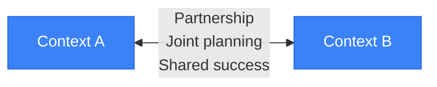
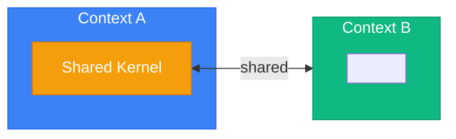
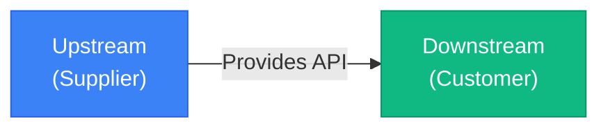
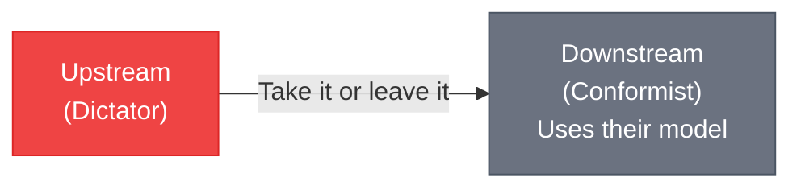
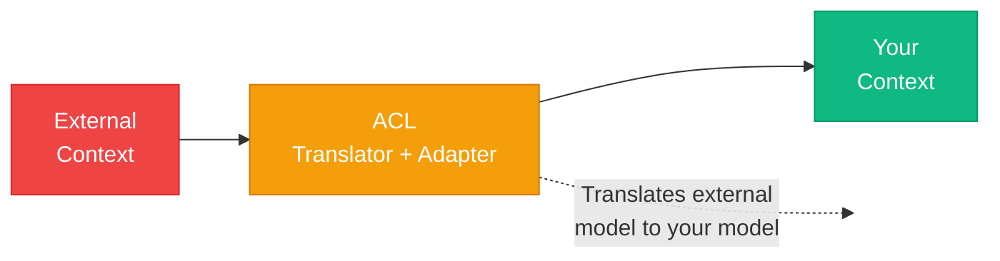
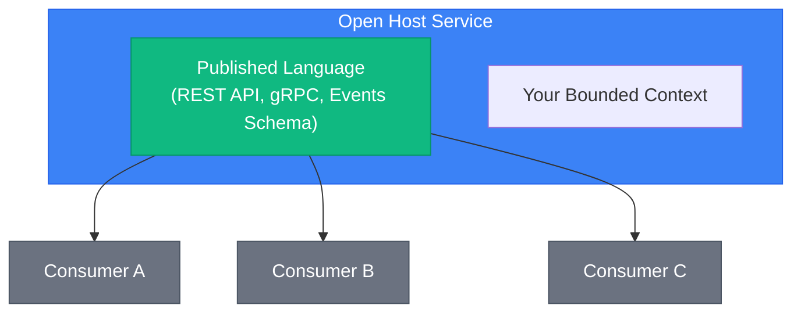
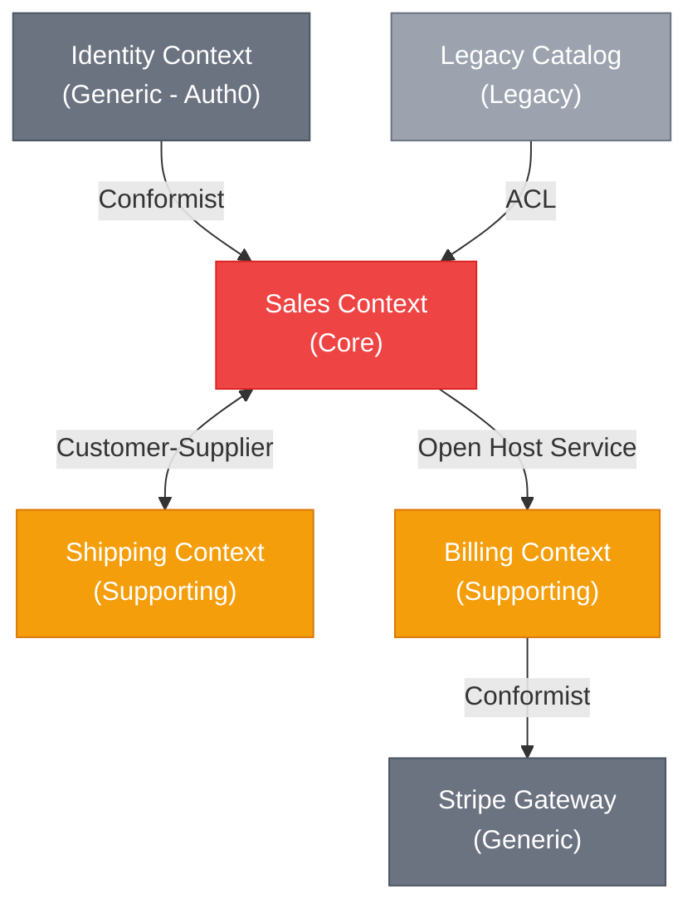

# Context Mapping and Integration

> Sources:
> - [Domain-Driven Design: The Blue Book](https://www.domainlanguage.com/ddd/blue-book/) — Eric Evans (2003)
> - [DDD Resources](https://www.domainlanguage.com/ddd/) — Domain Language (Eric Evans)
> - [Bounded Context](https://martinfowler.com/bliki/BoundedContext.html) — Martin Fowler
> - [Domain Driven Design](https://martinfowler.com/bliki/DomainDrivenDesign.html) — Martin Fowler
> - [Anti-Corruption Layer](https://docs.aws.amazon.com/prescriptive-guidance/latest/cloud-design-patterns/acl.html) — AWS
> - [Domain Analysis for Microservices](https://learn.microsoft.com/en-us/azure/architecture/microservices/model/domain-analysis) — Microsoft

Use this guide after identifying genuine bounded contexts. It explains their upstream/downstream relationships and the translation, event, and contract boundaries that prevent one context's model from leaking into another.

## Context Mapping

Describes relationships between bounded contexts.

### Relationship Patterns

#### Partnership
Two contexts succeed or fail together. Teams coordinate closely.



#### Shared Kernel
Two contexts share a subset of the domain model.



**Warning:** Shared kernels create coupling. Use sparingly.

#### Customer-Supplier
Upstream context provides what downstream needs.



#### Conformist
Downstream conforms to upstream's model with no negotiation power.



**Example:** Integrating with a third-party API (Stripe, AWS).

#### Anti-Corruption Layer (ACL)
Translation layer protecting your model from external models.



**Use when:**
- Integrating with legacy systems
- Integrating with third-party APIs
- External model is messy or poorly designed

```python
# Anti-Corruption Layer Example
# infrastructure/external/stripe/stripe_payment_acl.py

import stripe
from typing import Protocol


class StripePaymentACL:
    def __init__(self, stripe_client: stripe.StripeClient):
        self._stripe = stripe_client

    async def create_payment(self, payment: Payment) -> str:
        """Translates domain Payment to Stripe PaymentIntent."""
        payment_intent = await self._stripe.payment_intents.create(
            amount=payment.amount.cents,
            currency=payment.amount.currency.lower(),
            metadata={
                "order_id": payment.order_id.value,
                "customer_id": payment.customer_id.value,
            },
        )
        return payment_intent.id

    def translate_status(self, stripe_status: str) -> PaymentStatusEnum:
        """Translates Stripe status to domain PaymentStatusEnum."""
        mapping = {
            "requires_payment_method": PaymentStatusEnum.PENDING,
            "requires_confirmation": PaymentStatusEnum.PENDING,
            "requires_action": PaymentStatusEnum.PENDING,
            "processing": PaymentStatusEnum.PROCESSING,
            "succeeded": PaymentStatusEnum.COMPLETED,
            "canceled": PaymentStatusEnum.CANCELLED,
            "requires_capture": PaymentStatusEnum.AUTHORIZED,
        }
        return mapping.get(stripe_status, PaymentStatusEnum.UNKNOWN)

    def translate_webhook(self, event: stripe.Event) -> DomainEvent | None:
        """Translates Stripe webhook to domain event."""
        match event.type:
            case "payment_intent.succeeded":
                intent = event.data.object
                return PaymentCompleted(
                    payment_id=PaymentId(intent.metadata["order_id"]),
                    amount=Money.from_cents(intent.amount, intent.currency.upper()),
                )
            case "payment_intent.payment_failed":
                return None
            case _:
                return None
```

#### Open Host Service / Published Language
Expose a well-defined protocol for integration.



---

## Context Map Diagram

Visual representation of all bounded contexts and their relationships:



---

## Integration Patterns

### Domain Events for Context Integration

```python
# application/integration_events/order_placed_event.py
from pydantic import BaseModel


class AddressSchema(BaseModel):
    street: str
    city: str
    postal_code: str
    country: str


class OrderItemSchema(BaseModel):
    product_id: str
    quantity: int
    price: float


class OrderPlacedEvent(BaseModel):
    event_type: str = "sales.order.placed"
    order_id: str
    customer_id: str
    items: list[OrderItemSchema]
    total: float
    shipping_address: AddressSchema
    occurred_at: str


# shipping/event_handlers/order_placed_handler.py
class ShippingOrderPlacedHandler:
    def __init__(self, shipment_repo: IShipmentRepository):
        self._shipment_repo = shipment_repo

    async def handle(self, event: OrderPlacedEvent) -> None:
        shipment = Shipment.create(
            order_id=ShipmentOrderId(event.order_id),
            recipient=Recipient.from_address(event.shipping_address),
            packages=self._calculate_packages(event.items),
        )
        await self._shipment_repo.save(shipment)


# billing/event_handlers/order_placed_handler.py
class BillingOrderPlacedHandler:
    def __init__(self, invoice_repo: IInvoiceRepository):
        self._invoice_repo = invoice_repo

    async def handle(self, event: OrderPlacedEvent) -> None:
        invoice = Invoice.create(
            order_id=InvoiceOrderId(event.order_id),
            customer_id=BillingCustomerId(event.customer_id),
            line_items=[
                LineItem(
                    description=f"Product {item.product_id}",
                    quantity=item.quantity,
                    unit_price=Money.from_float(item.price),
                )
                for item in event.items
            ],
            total=Money.from_float(event.total),
        )
        await self._invoice_repo.save(invoice)
```

### Event Schema Registry

Define and version integration event schemas:

```json
{
  "$schema": "http://json-schema.org/draft-07/schema#",
  "$id": "https://api.company.com/events/sales/order-placed/v1.json",
  "title": "OrderPlaced",
  "description": "Published when an order is successfully placed",
  "type": "object",
  "required": ["eventType", "eventId", "orderId", "occurredAt"],
  "properties": {
    "eventType": { "const": "sales.order.placed" },
    "eventId": { "type": "string", "format": "uuid" },
    "orderId": { "type": "string", "format": "uuid" },
    "customerId": { "type": "string", "format": "uuid" },
    "total": { "type": "number", "minimum": 0 },
    "occurredAt": { "type": "string", "format": "date-time" }
  }
}
```

---

## Strategic Design Checklist

- [ ] Identify ubiquitous language terms with domain experts
- [ ] Map subdomains (core, supporting, generic)
- [ ] Define bounded context boundaries
- [ ] Document context map with relationships
- [ ] Design anti-corruption layers for external systems
- [ ] Define integration event schemas
- [ ] Ensure each context has its own data store
