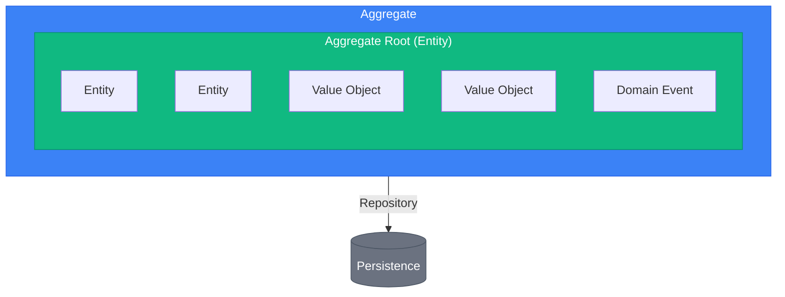
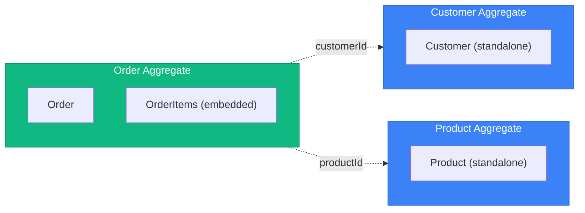
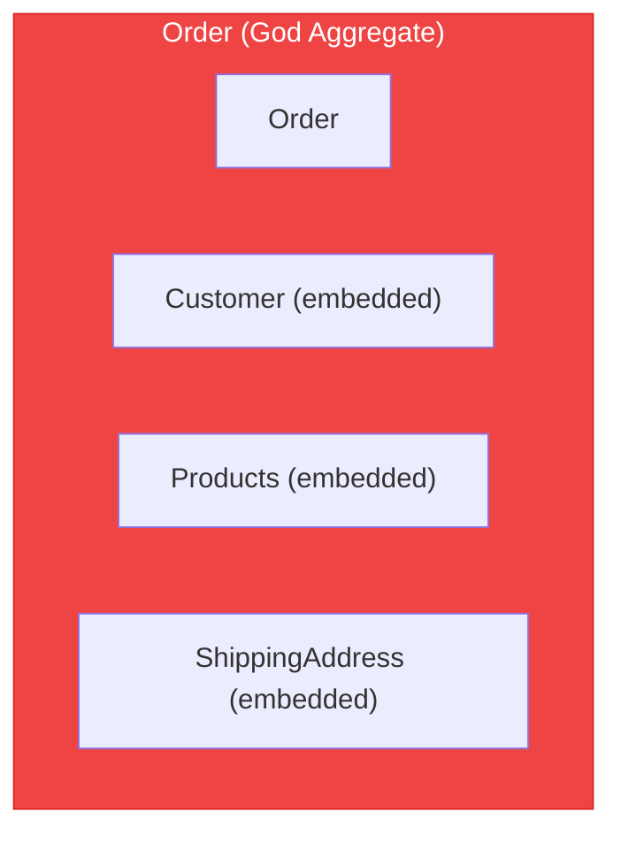

# DDD Tactical Patterns

> Sources:
> - [Domain-Driven Design: The Blue Book](https://www.domainlanguage.com/ddd/blue-book/) — Eric Evans (2003)
> - [Implementing Domain-Driven Design](https://openlibrary.org/works/OL17392277W) — Vaughn Vernon (2013)
> - [Effective Aggregate Design](https://www.dddcommunity.org/library/vernon_2011/) — Vaughn Vernon
> - [Repository Pattern](https://martinfowler.com/eaaCatalog/repository.html) — Martin Fowler (PoEAA)

## Building Blocks Overview



---

## Entity

An object with **identity** that persists through time. Two entities are equal if they have the same identity, regardless of attribute values.

### Characteristics

- Has a unique identifier
- Identity persists through lifecycle
- Can change attributes but remains the same entity
- Contains behavior (not just data)

### Pattern

```python
# app/domain/entities/base.py
import abc
from dataclasses import dataclass
from typing import Any


@dataclass(slots=True, kw_only=True)
class Entity[T]:
    @classmethod
    @abc.abstractmethod
    def create(cls, **kwargs: Any) -> T: ...


# app/domain/value_objects/order_id.py
from uuid import UUID, uuid4
from pydantic import Field
from app.domain.value_objects import ValueObject


class OrderId(ValueObject):
    value: UUID = Field(default_factory=uuid4)

    def get_id(self) -> UUID:
        return self.value


# app/domain/value_objects/customer_id.py
class CustomerId(ValueObject):
    value: UUID = Field(default_factory=uuid4)


# app/domain/value_objects/product_id.py
class ProductId(ValueObject):
    value: UUID = Field(default_factory=uuid4)


# app/domain/entities/order_item.py
from dataclasses import dataclass
from app.domain.entities import Entity
from app.domain.value_objects import ProductId, Money, Datetime


@dataclass
class OrderItem(Entity["OrderItem"]):
    id: OrderItemId
    product_id: ProductId
    quantity: int
    unit_price: Money
    created_at: Datetime

    @classmethod
    def create(
        cls,
        product_id: ProductId,
        quantity: int,
        unit_price: Money,
    ) -> "OrderItem":
        if quantity <= 0:
            raise ValueError(f"Quantity must be positive: {quantity}")

        return OrderItem(
            id=OrderItemId(),
            product_id=product_id,
            quantity=quantity,
            unit_price=unit_price,
            created_at=Datetime.now(),
        )

    def increase_quantity(self, amount: int) -> None:
        if amount <= 0:
            raise ValueError(f"Amount must be positive: {amount}")
        self.quantity += amount

    def subtotal(self) -> Money:
        return Money(
            amount=self.unit_price.amount * self.quantity,
            currency=self.unit_price.currency,
        )

    def __eq__(self, other: object) -> bool:
        if not isinstance(other, OrderItem):
            return False
        return self.id == other.id

    def __hash__(self) -> int:
        return hash(self.id)
```

---

## Value Object

An object defined by its **attributes**, not identity. Two value objects are equal if all their attributes are equal.

### Characteristics

- Immutable (frozen=True)
- No identity
- Equality by value (all attributes)
- Self-validating
- Side-effect-free methods

> **Scope note:** everything below is the VO as a domain building block. A VO must
> never be returned directly from an application-layer handler (command or query) — map
> it to a DTO first. See "DTO vs Value Object at the Handler Boundary" in `../SKILL.md`
> and the worked examples in `../cqrs/implementation.md`.

### Common Value Objects

| Value Object | Attributes | Validation |
|--------------|-----------|------------|
| Money | amount, currency | amount >= 0 |
| Email | value | valid email format |
| Phone | value | valid phone format |
| Datetime | value | valid datetime |

### Pattern

```python
# app/domain/value_objects/base.py
from pydantic import BaseModel, ConfigDict


class ValueObject(BaseModel):
    model_config = ConfigDict(frozen=True, from_attributes=True)

    def __str__(self):
        if hasattr(self, "value"):
            return str(self.value)
        return super().__str__()


# app/utils/__init__.py (FrozenObject is same as ValueObject)
from pydantic import BaseModel, ConfigDict


class FrozenObject(BaseModel):
    model_config = ConfigDict(frozen=True, from_attributes=True)


# app/domain/value_objects/money.py
from app.domain.value_objects import ValueObject


class Money(ValueObject):
    amount: float
    currency: str

    def add(self, other: "Money") -> "Money":
        if self.currency != other.currency:
            raise ValueError(f"Cannot add {self.currency} and {other.currency}")
        return Money(amount=self.amount + other.amount, currency=self.currency)

    def subtract(self, other: "Money") -> "Money":
        if self.currency != other.currency:
            raise ValueError(f"Cannot subtract {self.currency} and {other.currency}")
        return Money(amount=self.amount - other.amount, currency=self.currency)

    def multiply(self, factor: float) -> "Money":
        return Money(amount=self.amount * factor, currency=self.currency)

    @staticmethod
    def zero(currency: str = "USD") -> "Money":
        return Money(amount=0.0, currency=currency)


# app/domain/value_objects/email.py
from pydantic import EmailStr
from app.domain.value_objects import ValueObject


class Email(ValueObject):
    value: EmailStr

    def __str__(self):
        return str(self.value)

    @property
    def domain(self) -> str:
        return str(self.value).split("@")[1]


# app/domain/value_objects/phone.py
class Phone(ValueObject):
    value: str

    def __str__(self):
        return str(self.value)


# app/domain/value_objects/datetime.py
from datetime import datetime as dt, timezone


class Datetime(ValueObject):
    value: dt

    @staticmethod
    def now() -> "Datetime":
        return Datetime(value=dt.now(timezone.utc))

    def __str__(self):
        return self.value.isoformat()
```

---

## Aggregate

A cluster of entities and value objects treated as a single unit for data changes. Has a **consistency boundary**.

### Rules

1. **One aggregate root** - Single entry point for all modifications
2. **Reference by ID only** - Aggregates reference others by identity, never by direct object reference
3. **Transaction boundary** - One aggregate per transaction (eventual consistency between aggregates)
4. **Invariants within boundary** - Aggregate ensures its own consistency
5. **Small aggregates** - Prefer smaller over larger

### Aggregate Sizing Heuristics

| Metric | Healthy | Warning | Action |
|--------|---------|---------|--------|
| Entities per aggregate | 1-5 | 6-10 | >10: Split |
| Lines of code (root) | <500 | 500-1000 | >1000: Split |
| Transaction lock time | <100ms | 100-500ms | >500ms: Split |
| Concurrent modification conflicts | Rare | Occasional | Frequent: Split |

**Questions to ask:**
- Can parts be eventually consistent? → Separate aggregates
- Do all parts change together? → Same aggregate
- Are there independent lifecycles? → Separate aggregates

### Design Guidelines

**Good: Small Aggregates**



*Reference by ID only*

**Bad: God Aggregate**



*Too large, too many reasons to change, contention issues*

### Pattern

```python
# app/domain/entities/order.py
from __future__ import annotations
from dataclasses import dataclass, field
from enum import Enum

from app.domain.entities import Entity
from app.domain.value_objects import OrderId, CustomerId, Datetime


class OrderStatusEnum(str, Enum):
    DRAFT = "draft"
    CONFIRMED = "confirmed"
    SHIPPED = "shipped"
    DELIVERED = "delivered"
    CANCELLED = "cancelled"


@dataclass
class Order(Entity["Order"]):
    id: OrderId
    customer_id: CustomerId
    status: OrderStatusEnum
    items: list[OrderItem] = field(default_factory=list)
    created_at: Datetime = field(default_factory=Datetime.now)
    updated_at: Datetime = field(default_factory=Datetime.now)
    confirmed_at: Datetime | None = None

    @classmethod
    def create(cls, customer_id: CustomerId) -> "Order":
        """Create a new draft order."""
        order = Order(
            id=OrderId(),
            customer_id=customer_id,
            status=OrderStatusEnum.DRAFT,
            created_at=Datetime.now(),
            updated_at=Datetime.now(),
        )
        # Domain events can be added here
        return order

    def add_item(
        self,
        product_id: ProductId,
        quantity: int,
        unit_price: Money
    ) -> None:
        """Add item to order or increase quantity if already exists."""
        if self.status in [OrderStatusEnum.CANCELLED, OrderStatusEnum.SHIPPED]:
            raise ValueError(f"Cannot add items to {self.status.value} order")

        if quantity <= 0:
            raise ValueError(f"Quantity must be positive: {quantity}")

        # Check if item already exists
        existing_item = next(
            (item for item in self.items if item.product_id == product_id),
            None
        )

        if existing_item:
            existing_item.increase_quantity(quantity)
        else:
            new_item = OrderItem.create(
                product_id=product_id,
                quantity=quantity,
                unit_price=unit_price,
            )
            self.items.append(new_item)

        self.updated_at = Datetime.now()

    def remove_item(self, product_id: ProductId) -> None:
        """Remove item from order."""
        if self.status in [OrderStatusEnum.CANCELLED, OrderStatusEnum.SHIPPED]:
            raise ValueError(f"Cannot remove items from {self.status.value} order")

        item = next(
            (item for item in self.items if item.product_id == product_id),
            None
        )
        if not item:
            raise ValueError(f"Item not found: {product_id.value}")

        self.items.remove(item)
        self.updated_at = Datetime.now()

    def confirm(self) -> None:
        """Confirm the order."""
        if self.status != OrderStatusEnum.DRAFT:
            raise ValueError(f"Cannot confirm {self.status.value} order")

        if not self.items:
            raise ValueError("Cannot confirm order with no items")

        self.status = OrderStatusEnum.CONFIRMED
        self.confirmed_at = Datetime.now()
        self.updated_at = Datetime.now()

    def ship(self) -> None:
        """Mark order as shipped."""
        if self.status != OrderStatusEnum.CONFIRMED:
            raise ValueError(f"Cannot ship {self.status.value} order")

        self.status = OrderStatusEnum.SHIPPED
        self.updated_at = Datetime.now()

    def cancel(self, reason: str) -> None:
        """Cancel the order."""
        if self.status in [OrderStatusEnum.SHIPPED, OrderStatusEnum.DELIVERED]:
            raise ValueError(f"Cannot cancel {self.status.value} order")

        self.status = OrderStatusEnum.CANCELLED
        self.updated_at = Datetime.now()

    @property
    def total(self) -> Money:
        """Calculate total from all items."""
        if not self.items:
            return Money.zero()

        return sum(
            (item.subtotal() for item in self.items),
            Money.zero(self.items[0].unit_price.currency),
        )

    @property
    def item_count(self) -> int:
        """Total number of items (sum of quantities)."""
        return sum(item.quantity for item in self.items)

    def __eq__(self, other: object) -> bool:
        if not isinstance(other, Order):
            return False
        return self.id == other.id

    def __hash__(self) -> int:
        return hash(self.id)
```

---

## Repository

Provides collection-like access to aggregates. Abstracts persistence.

### Rules

1. **One repository per aggregate** - Not per entity or table
2. **Domain interface** - Interface in domain, implementation in infrastructure
3. **Aggregate-focused** - Save/load entire aggregates
4. **No query logic** - Complex queries belong in separate read models

### Pattern

```python
# app/domain/repository/i_order_repository.py
import abc
from uuid import UUID
from app.domain.entities import Order
from app.domain.value_objects import CustomerId, Email


class IOrderRepository(abc.ABC):
    """Repository interface for Order aggregate."""

    @abc.abstractmethod
    async def get_by_id(self, id: UUID) -> Order | None: ...

    @abc.abstractmethod
    async def save(self, order: Order) -> Order: ...

    @abc.abstractmethod
    async def update(self, order: Order) -> Order: ...

    @abc.abstractmethod
    async def delete(self, id: UUID) -> None: ...

    @abc.abstractmethod
    async def get_by_customer_id(self, customer_id: CustomerId) -> list[Order]: ...


# Note: Protocol can also be used instead of ABC
# from typing import Protocol

# class IOrderRepository(Protocol):
#     async def get_by_id(self, id: UUID) -> Order | None: ...
#     async def save(self, order: Order) -> Order: ...
#     async def delete(self, id: UUID) -> None: ...
```

### Common Mistakes

**Wrong: Repository per entity**

```python
# Don't do this
class IOrderItemRepository(Protocol):
    async def find_by_order_id(self, order_id: OrderId) -> list[OrderItem]: ...
    async def save(self, item: OrderItem) -> None: ...
```

**Wrong: Query methods in repository**

```python
# Don't do this
class IOrderRepository(Protocol):
    async def find_by_status(self, status: OrderStatusEnum) -> list[Order]: ...
    async def find_by_date_range(self, start: datetime, end: datetime) -> list[Order]: ...
    async def count_by_customer(self, customer_id: CustomerId) -> int: ...
```

**Correct: Aggregate-focused + separate read model**

```python
# Do this
class IOrderRepository(abc.ABC):
    async def get_by_id(self, id: UUID) -> Order | None: ...
    async def save(self, order: Order) -> Order: ...


class IOrderReadRepository(abc.ABC):
    async def find_by_status(self, status: str) -> list[OrderDTO]: ...
    async def find_by_date_range(
        self, start: datetime, end: datetime
    ) -> list[OrderDTO]: ...
    async def count_by_customer(self, customer_id: str) -> int: ...
```

---

## Domain Service

Stateless operations that don't naturally fit within an entity or value object.

### When to Use

- Operation involves multiple aggregates
- Operation requires external information
- Significant business logic that doesn't belong to one entity

### Pattern

```python
# app/domain/services/pricing_service.py
from app.domain.entities import Order, Customer
from app.domain.value_objects import Money


class PricingService:
    """Domain service for calculating pricing and discounts."""

    async def calculate_discount(self, order: Order, customer: Customer) -> Money:
        discount = Money.zero(order.total.currency)

        # Bulk discount
        if order.item_count > 10:
            discount = discount.add(order.total.multiply(0.05))

        # VIP discount
        if customer.is_vip:
            discount = discount.add(order.total.multiply(0.10))

        # Cap discount at 20%
        max_discount = order.total.multiply(0.20)
        return min(discount, max_discount, key=lambda m: m.amount)


# app/domain/services/shipping_calculator.py
class ShippingCalculator:
    """Domain service for calculating shipping costs."""

    async def calculate(
        self,
        items: list[OrderItem],
        destination: Address
    ) -> Money:
        base_rate = Money(amount=5.99, currency="USD")
        per_item_rate = Money(amount=1.50, currency="USD")

        total = base_rate.add(per_item_rate.multiply(len(items)))

        # International shipping
        if destination.country != "US":
            total = total.add(Money(amount=15.00, currency="USD"))

        return total
```

---

## Unit of Work (UoW)

The Unit of Work pattern maintains a list of objects affected by a business transaction and coordinates writing out changes.

### Pattern

```python
# app/application/ports/i_unit_of_work.py
import abc
from typing import Protocol


class IUnitOfWork(Protocol):
    async def __aenter__(self): ...
    async def __aexit__(self, *args): ...
    async def commit(self) -> None: ...
    async def rollback(self) -> None: ...


# app/application/ports/i_order_unit_of_work.py
class IOrderUoW(abc.ABC):
    @property
    @abc.abstractmethod
    def orders(self) -> IOrderRepository: ...

    @abc.abstractmethod
    async def __aenter__(self): ...

    @abc.abstractmethod
    async def __aexit__(self, *args): ...

    @abc.abstractmethod
    async def commit(self) -> None: ...

    @abc.abstractmethod
    async def rollback(self) -> None: ...


# app/infrastructure/db/unit_of_work.py
from sqlalchemy.ext.asyncio import AsyncSession
from app.infrastructure.db.repository import OrderRepository


class SQLAlchemyOrderUoW:
    def __init__(self, session: AsyncSession):
        self._session = session

    @property
    def orders(self) -> IOrderRepository:
        return OrderRepository(self._session)

    async def __aenter__(self):
        return self

    async def __aexit__(self, exc_type, exc_val, exc_tb):
        if exc_type:
            await self.rollback()
        await self._session.close()

    async def commit(self) -> None:
        await self._session.commit()

    async def rollback(self) -> None:
        await self._session.rollback()
```

---

## Factory

Encapsulates complex aggregate/entity creation.

### When to Use

- Creation logic is complex
- Need to enforce invariants during creation
- Need to create object graphs

### Pattern

```python
# app/domain/services/order_factory.py
from app.domain.entities import Order, Customer, Cart
from app.domain.value_objects import CustomerId


class OrderFactory:
    """Factory for creating orders from other aggregates."""

    async def create_from_cart(self, cart: Cart, customer: Customer) -> Order:
        """Create an order from a shopping cart."""
        if not cart.items:
            raise ValueError("Cannot create order from empty cart")

        order = Order.create(customer_id=customer.id)

        for cart_item in cart.items:
            order.add_item(
                product_id=cart_item.product_id,
                quantity=cart_item.quantity,
                unit_price=cart_item.unit_price,
            )

        return order
```

---

## Specification

A named, reusable business predicate (`is_satisfied_by(candidate) -> bool`), composable
via AND/OR/NOT. Use it when the same business rule is checked in 2+ places (validating
a candidate, selecting from a collection/repository, or constraining what a factory
builds) — not for a one-off `if`, and not as a substitute for an ordinary CQRS query
filter. See [the specification pattern](../patterns/specification.md) for the full pattern, all three uses,
and the composable base classes.
